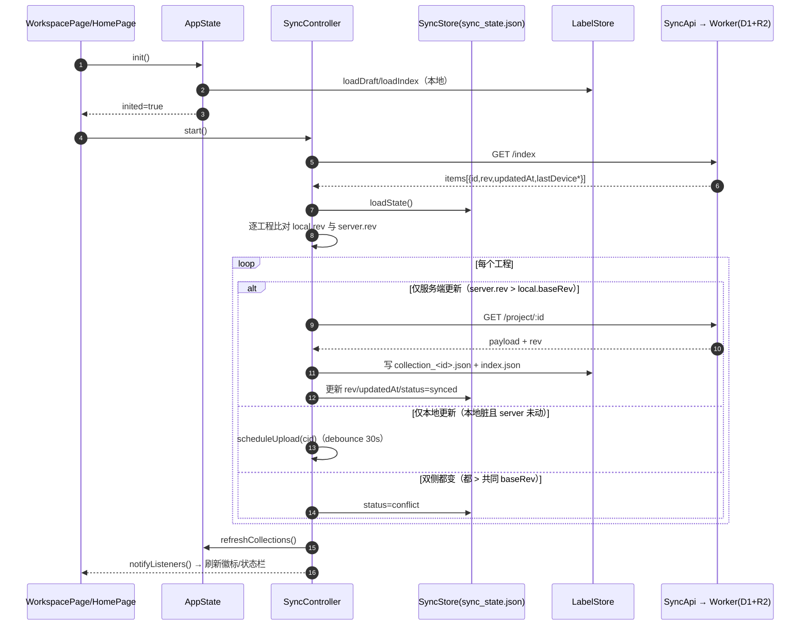
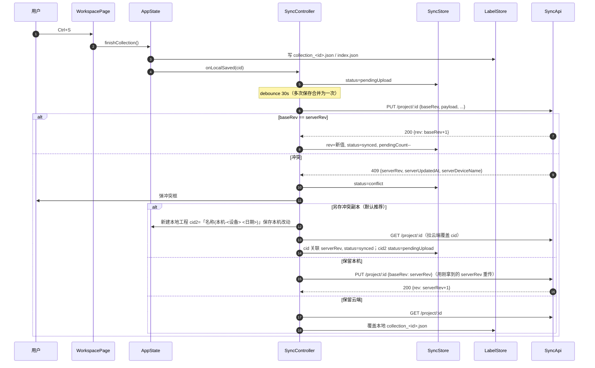
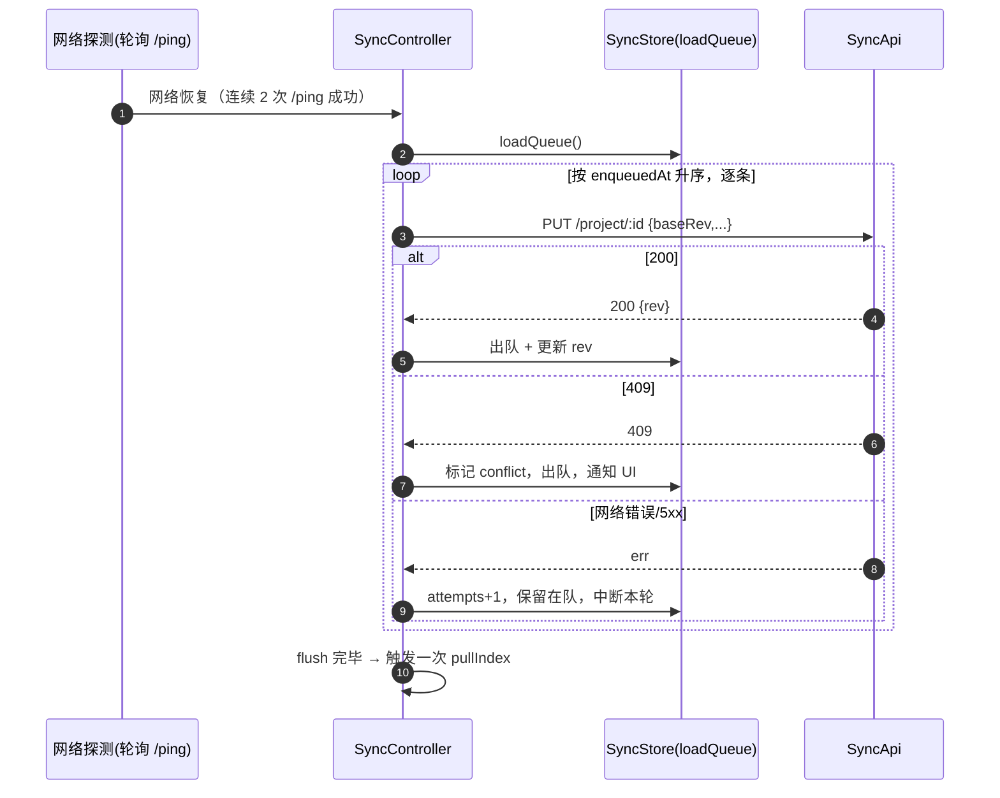
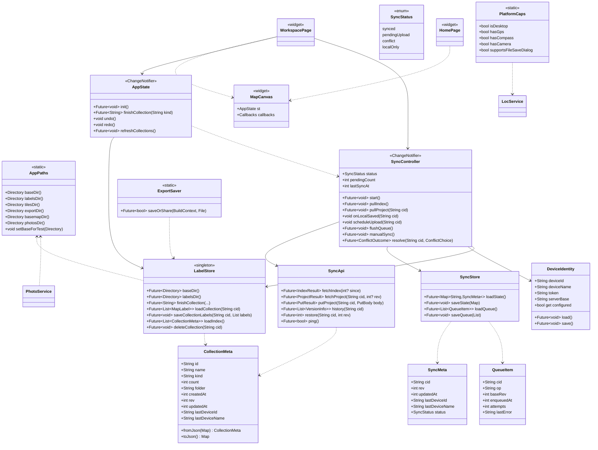
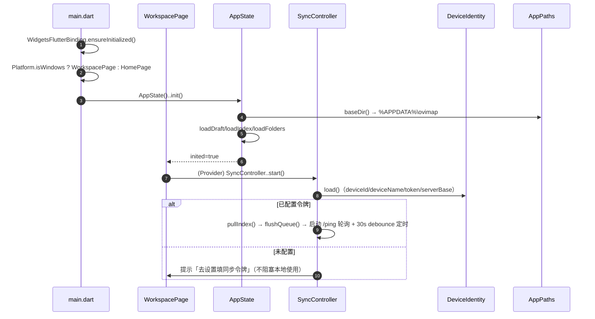
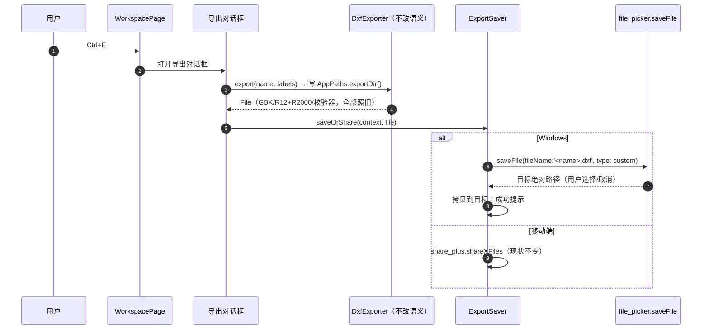
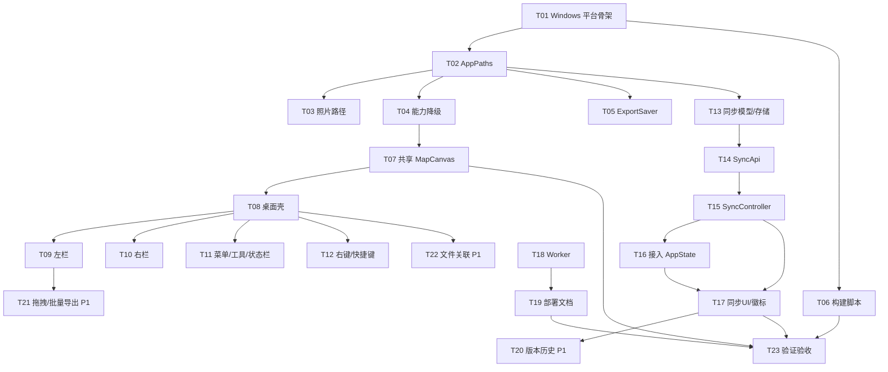

# 架构设计：滑洲云图 ovimap — Windows 桌面版 + Cloudflare 云同步

> 版本：v1.0 · 作者：高见远（Architect） · 上游：`docs/PRD-windows-sync.md`（许清楚）
> 状态：待评审 → 交付工程师实现
> 语言：中文

---

## 目录

- [0. 一句话结论](#0-一句话结论)
- [1. 实现方案与选型](#1-实现方案与选型)
- [2. Windows 平台适配方案](#2-windows-平台适配方案)
- [3. 桌面 UI 架构](#3-桌面-ui-架构)
- [4. Cloudflare 同步架构](#4-cloudflare-同步架构)
- [5. 向后兼容](#5-向后兼容)
- [6. 构建与分发](#6-构建与分发)
- [7. 文件列表](#7-文件列表)
- [8. 数据结构与接口](#8-数据结构与接口)
- [9. 程序调用流程](#9-程序调用流程)
- [10. 任务列表](#10-任务列表)
- [11. 依赖包列表](#11-依赖包列表)
- [12. 共享知识](#12-共享知识)
- [13. 待明确事项](#13-待明确事项)

---

## 0. 一句话结论

**沿用 Flutter，新增 `windows/` 平台，用「共用核心 + 平台分支壳」适配桌面 UI，用「D1 存索引/rev + R2 存快照」在 Cloudflare 上落地工程级乐观并发同步（`baseRev` 校验 + 409 冲突 + 冲突副本 + ≥10 版本），新增依赖为 0。**

四条硬约束（来自 PRD + 主理人）：
1. 既有业务语义（DXF 导出、链路算法、坐标纠偏、GeoJSON 导入）**一行不动**。
2. 手机 ↔ 电脑工程文件**可直接互换**（目录结构 `labels/` 对齐）。
3. `file_picker` **锁 9.2.3**，不得升级。
4. 新增依赖**能不加就不加**（本设计结论：**新增运行时依赖 0 个**）。

---

## 1. 实现方案与选型

| 维度 | 选择 | 理由 |
|---|---|---|
| 桌面框架 | **沿用 Flutter（当前 3.47.2 stable）** | 一套 Dart 代码同时跑 Android/Windows，`flutter_map 8 + latlong2` 是纯 Dart 已原生支持 Windows；换栈意味着重写 1.5 万行业务，收益为负。 |
| 地图渲染 | 保持 `flutter_map` | 桌面端（鼠标滚轮缩放、拖拽平移、旋转）flutter_map 原生支持交互。 |
| 状态管理 | 保持 `provider`；新增 `SyncController`（也是 ChangeNotifier） | 与现有 `AppState` 同构，零学习成本。 |
| 同步后端 | **Cloudflare D1 + R2**（不用 KV） | 见 §4.1。 |
| 桌面窗口最小尺寸 | **改 `windows/runner` 的 C++（WM_GETMINMAXINFO）** | 零新增依赖即可实现 B1 的「最小 1024×680」；`window_manager` 作为备选。 |
| 导出落盘 | 新增 `ExportSaver` 抽象层，Windows 走 `file_picker.saveFile`，移动端走 `share_plus` | 桌面无「分享」语义，必须换成「另存为」。 |

**架构模式**：分层 + 单向数据流。`ui/`（View）→ `state/`（ChangeNotifier）→ `services/`（持久化/网络/平台）→ `models/`（数据）。桌面壳与移动壳共享 `state` 与 `services`。

---

## 2. Windows 平台适配方案

### 2.1 生成 `windows/` 平台

在项目根目录执行（只做一次，产物入库）：

```bash
flutter config --enable-windows-desktop
flutter create --platforms=windows .
```

生成 `windows/` 目录（`runner/`、`flutter/`、`CMakeLists.txt` 等）。**不改动 `android/`**。

生成后需要**改 4 处 C++/资源文件**（见 §3.4 与 §6）：

| 文件 | 改动 |
|---|---|
| `windows/runner/main.cpp` | 初始窗口尺寸设 `1440×900`；调用最小尺寸设置 |
| `windows/runner/win32_window.cpp` | 处理 `WM_GETMINMAXINFO` → 最小 `1024×680` |
| `windows/runner/Runner.rc` | `CompanyName=滑洲云图`、`ProductName=滑洲云图`、`FileDescription=ovimap`、图标 `resources/app_icon.ico` |
| `windows/CMakeLists.txt` | `project(ovimap ...)`、`BINARY_NAME "ovimap"` |

> 目录/可执行名统一用英文 `ovimap`（避免中文路径在 MSVC/CMake 下的编码坑）；显示名用「滑洲云图」。

### 2.2 现有依赖 Windows 支持逐项评估

**结论表**（✅ 原生支持 / ⚠️ 需条件分支 / ❌ 不可用需替代 / 🧪 需在 Windows 上实测）：

| 依赖 | 版本 | Windows 判定 | 处置 |
|---|---|---|---|
| `flutter_map` | 8.3.2 | ✅ 纯 Dart | 直接用 |
| `latlong2` | 0.9.1 | ✅ 纯 Dart | 直接用 |
| `provider` | 6.1.0 | ✅ 纯 Dart | 直接用 |
| `http` | 1.2.0 | ✅ 纯 Dart | 直接用于同步 |
| `intl` | 0.20.0 | ✅ 纯 Dart | 直接用 |
| `gbk_codec` | 0.4.0 | ✅ 纯 Dart | DXF GBK 编码照旧 |
| `archive` | 3.6.1 | ✅ 纯 Dart | ZIP 成册照旧 |
| `path_provider` | 2.1.x | ✅ `path_provider_windows` 已在 lock | 见 §2.4 路径适配 |
| `shared_preferences` | 2.2.x | ✅ `shared_preferences_windows` 已在 lock | 直接用 |
| `file_picker` | **9.2.3（锁定）** | ✅ 官方支持 Windows（`pickFiles` + `saveFile` 均为 win32 原生） | **保持 9.2.3，禁止升级**；🧪 需实测一次 |
| `geolocator` | 13.0.4 | ⚠️ 有 `geolocator_windows`，但桌面通常无 GPS/未开定位服务 | 条件分支 + 降级（§2.3） |
| `flutter_compass` | 0.8.1 | ❌ **无 Windows 实现**（仅 iOS/Android），调用会抛 `MissingPluginException` | 由 `PlatformCaps` 拦截，桌面直接不订阅 |
| `image_picker` | 1.1.2 | ⚠️ `image_picker_windows` 仅有「选文件」能力，**`ImageSource.camera` 桌面不支持** | 相机入口在桌面隐藏，改「选文件」（§2.3） |
| `share_plus` | 10.1.4 | ⚠️ 桌面无「分享目标」，`shareXFiles` 在 Windows 不可用/无效果 | 由 `ExportSaver` 改为「另存为」（§2.3） |
| `dependency_overrides: flutter_plugin_android_lifecycle: 2.0.22` | — | ✅ 仅 Android 端生效，Windows 构建不包含该插件 | **保留**，不影响 Windows；🧪 需实测 `flutter pub get` 通过 |

> **关键风险点**：`flutter_compass`（❌）与 `share_plus`/`image_picker.camera`（⚠️）是本项目在 Windows 上**唯三**会「崩/无效」的地方，其余全部可用。所有 ❌/⚠️ 均通过 §2.3 的 `PlatformCaps` + `ExportSaver` 两处收口，不改业务语义。

### 2.3 降级策略（桌面无 GPS/罗盘/相机）

新增 `lib/services/platform_caps.dart`（**能力探测，单点收口**）：

```dart
class PlatformCaps {
  static final bool isDesktop = Platform.isWindows || Platform.isLinux || Platform.isMacOS;
  static bool get hasGps     => !Platform.isWindows;      // 桌面默认无 GPS（可被 override）
  static bool get hasCompass => Platform.isAndroid || Platform.isIOS; // flutter_compass 仅移动端
  static bool get hasCamera  => Platform.isAndroid || Platform.isIOS; // image_picker.camera 仅移动端
  static bool get supportsFileSaveDialog => Platform.isWindows; // file_picker.saveFile
}
```

| 能力 | 移动端（现状不变） | Windows 桌面（降级） |
|---|---|---|
| GPS 定位 | `LocService.start()` 订阅真实位置流 | **不订阅**；`curLat/curLon=null`；打点走「手动落点」 |
| 手动落点 | — | 工具栏「打点」按钮 = 屏幕中心 / 鼠标点选处落点（复用 `AppState` 现有点选逻辑） |
| 罗盘 | `flutter_compass` 订阅航向 | **不订阅**；`CompassWidget` 隐藏/置灰；`_hasHeading=false`（现有 UI 已能处理 `hasHeading=false`） |
| 相机拍照 | `ImageSource.camera` | 隐藏「拍照」，改「选择图片文件」（`image_picker` gallery 或 `file_picker`），仍走 `PhotoService.importFile` |
| 导出分享 | `share_plus.shareXFiles` | `file_picker.saveFile` 另存到用户所选路径 |

**改动落点**：
- `lib/services/loc.dart`：`start()` 首行加 `if (PlatformCaps.isDesktop) { _running=false; return; }`；`ensureGranted()` 桌面直接 `return false`；罗盘订阅前加 `if (!PlatformCaps.hasCompass) skip`。**不删任何方法**（移动端行为不变）。
- `lib/ui/home_page.dart`：罗盘 `CompassWidget` 用 `if (PlatformCaps.hasCompass)` 包裹。
- `lib/ui/dialogs.dart`：`_pickAndAttachPhoto` 中 `ImageSource.camera` 分支在桌面改为 `ImageSource.gallery`（即选文件）。

### 2.4 存储路径适配（`%APPDATA%/ovimap`）

新增 `lib/services/app_paths.dart`，把「权威数据目录」单点化：

```dart
class AppPaths {
  static Directory? _force;                 // 测试注入
  static void setBaseForTest(Directory d) => _force = d;

  /// 权威数据根目录：
  ///   Android : getExternalStorageDirectory() ?? getApplicationSupportDirectory() → <ext>/ovimap   （与旧版一致，不得变）
  ///   Windows : %APPDATA%\ovimap（即 C:\Users\<用户>\AppData\Roaming\ovimap）
  ///   other   : getApplicationSupportDirectory()
  static Future<Directory> baseDir() async {
    if (_force != null) return _ensure(_force!);
    if (Platform.isWindows) {
      final appData = Platform.environment['APPDATA'];
      if (appData != null && appData.isNotEmpty) return _ensure(Directory('$appData\\ovimap'));
    }
    final ext = Platform.isAndroid
        ? (await getExternalStorageDirectory() ?? await getApplicationSupportDirectory())
        : await getApplicationSupportDirectory();
    return _ensure(Directory('${ext.path}/ovimap'));
  }

  static Future<Directory> labelsDir() => _sub('labels');
  static Future<Directory> tilesDir()  => _sub('tiles');
  static Future<Directory> basemapDir()=> _sub('labels/basemap');
  static Future<Directory> exportDir() => _sub('labels/export');
  static Future<Directory> photosDir() => _sub('photos');   // 见下
  ...
}
```

**对齐关系（谁是权威 / 如何互换）**：

| 平台 | 根目录 | `labels/` | 结论 |
|---|---|---|---|
| Android | `<外部存储>/ovimap`（现状，**权威**） | `<根>/labels/{index.json, collection_*.json, draft.json, folders.json}` | 不动 |
| Windows | `%APPDATA%\ovimap` | `%APPDATA%\ovimap\labels\{同左}` | 结构**逐字对齐** |
| 互换方式 | — | — | （1）主通道：云同步（§4）；（2）兜底：整目录拷贝 `labels/` 覆盖，因相对结构一致可直接识别 |

> **照片目录**：`photos/` 目前 Android 落在 `getApplicationDocumentsDirectory()/photos`（不在 `/ovimap` 下）。为**不动 Android 现状**，`AppPaths.photosDir()` 在 Android 仍返回原路径、在 Windows 返回 `%APPDATA%\ovimap\photos`。照片不参与同步（PRD 决策），`MapLabel.photoPaths` 只存**相对文件名**，因此跨端互换不受影响。
>
> **`store.dart::baseDir()` 改造**：删除内部 `getExternalStorageDirectory()` 逻辑，改为 `return AppPaths.baseDir()`；`labelsDir/tilesDir/exportDir/basemapDir` 全部委托 `AppPaths`。`setBaseDirForTest` 保留（转调 `AppPaths.setBaseForTest`），**保证现有 49 个测试的注入点不破坏**。

---

## 3. 桌面 UI 架构

### 3.1 总体决策：**共用核心 + 两套壳**（非「单套 widget 加大量 Platform 分支」）

理由：现有 `home_page.dart` 是 1946 行的「竖屏 + Drawer + 浮层」结构，桌面要的是「横屏 + 常驻三栏 + 菜单栏 + 右键 + 快捷键」。在同一文件里塞两套布局会让两边都难维护；但地图渲染、打点、连线、属性编辑等**逻辑**必须复用。

分层如下：

```
lib/ui/
  map/
    map_canvas.dart          【新增】共享地图核心：FlutterMap + 全部图层 + 框选层
                             （从 home_page 抽出，供两壳复用）
  home_page.dart             【修改】移动壳：保留竖屏 Chrome，地图部分换成 MapCanvas
  desktop/
    workspace_page.dart      【新增】桌面壳：Scaffold + 菜单栏 + 工具栏 + 三栏 + 状态栏 + 快捷键
    left_panel.dart          【新增】左栏：文件夹树 + 工程列表(含同步徽标) + 搜索 + 拖拽导入区
    right_panel.dart         【新增】右栏：选中点属性面板
    app_menu_bar.dart        【新增】顶部菜单栏（文件/工程/底图/导出/同步/设置）
    toolbar.dart             【新增】工具栏（打点/连线路/测距/撤销重做/缩放/图源/🔄同步）
    status_bar.dart          【新增】状态栏（设备名/同步状态/最后同步时间/坐标/图源）
    context_menu.dart        【新增】右键菜单（点/线/空白三态）
    shortcuts.dart           【新增】Shortcuts/Actions + Intent 定义
  sync/
    sync_panel.dart          【新增】同步面板（移动端与桌面共用）
    conflict_dialog.dart     【新增】冲突三选一对话框（共用）
```

`main.dart` 增加分支：

```dart
import 'dart:io' show Platform;
...
home: Platform.isWindows ? const WorkspacePage() : const HomePage(),
```

### 3.2 三栏布局（B5）

`WorkspacePage` 用 `Row` + 可拖拽分隔条：

```
Column
├─ AppMenuBar                     (高度 34)
├─ Toolbar                        (高度 48)
├─ Expanded
│    Row
│    ├─ LeftPanel                 (宽 260，可折叠/拖拽 200~420)
│    ├─ VerticalDivider (可拖拽)
│    ├─ Expanded( MapCanvas )
│    └─ VerticalDivider (可拖拽)
│    └─ RightPanel                (宽 300，可折叠/拖拽 240~460)
└─ StatusBar                      (高度 26)
```

- 折叠/拖拽宽度用本地 `double` state + `GestureDetector(onHorizontalDragUpdate)`，无需第三方 splitter 包。
- 最小窗口 1024×680 由 §2.1 的 C++ 保证；`LayoutBuilder` 在窗口 < 1180 时自动收起右栏，避免挤压。

### 3.3 鼠标操作 / 右键 / 快捷键

**鼠标（B2）**：flutter_map 8 原生支持滚轮缩放 + 拖拽平移 + 双击缩放。`MapOptions.interactionOptions` 追加 `InteractiveFlag.all`（含 `rotate`）。
- 左键点选 / 框选：框选复用现有 `_MarqueeLayer`（从 home_page 迁入 `map_canvas.dart`）。
- 双击定位：flutter_map `doubleTapZoom`；若需语义为「定位到该点」则在 `onTap` 计数判定。

**右键菜单（B3）**：`MapOptions.onSecondaryTapUp(_, point)` 取 `(TapPosition, LatLng)` → 判断命中对象（点在 `labels` 里按屏幕距离阈值命中 → 命中线段 → 空白）→
用 **`showMenu(context, position: RelativeRect...)`** 或 **`MenuAnchor`**（Flutter 原生，零依赖）弹出。菜单项：
- 点：编辑属性、删除、插入点到其后、设为桩号起点、复制坐标、附着照片。
- 线段：设置敷设方式（架空/埋地/管道）、设置光缆型号、设置盘留、删除该段。
- 空白：在此打点、粘贴坐标点、导入文件到此、回到当前位置。

**快捷键（B4）**：用 Flutter 原生 **`Shortcuts` + `Actions` + `Intent`**（零依赖），包在 `WorkspacePage` 最外层：

| 键 | Intent | Action |
|---|---|---|
| `Ctrl+S` | `SaveIntent` | `AppState.finishCollection()` |
| `Ctrl+Z` | `UndoIntent` | `AppState.undo()` |
| `Ctrl+Y` / `Ctrl+Shift+Z` | `RedoIntent` | `AppState.redo()` |
| `Delete` | `DeleteSelectionIntent` | `AppState.deleteSelected()` |
| `Ctrl+E` | `ExportDxfIntent` | 打开导出对话框（DXF） |
| `Ctrl+F` | `FocusSearchIntent` | 左栏搜索框聚焦 |

> 现有 `AppState` 已有撤销/重做/删除选中能力（home_page 的底部工具条在用），此处**只接线，不改逻辑**。

### 3.4 窗口与主题

- `windows/runner/main.cpp`：`window.Create(L"滑洲云图", origin, Size(1440, 900))`。
- `windows/runner/win32_window.cpp`：`case WM_GETMINMAXINFO:` 设 `ptMinTrackSize = {1024, 680}`。
- 主题沿用 `main.dart` 现有暗色 `ThemeData`（`useMaterial3:false`）。
- 中文字体：Windows 自带「微软雅黑」，Flutter 默认字体回退可用；如显存观感问题，在 `ThemeData.fontFamily` 指定 `'Microsoft YaHei'`（可选，不改逻辑）。

---

## 4. Cloudflare 同步架构

### 4.1 存储选型：D1（索引/rev） + R2（快照），不用 KV

| 方案 | 结论 | 理由 |
|---|---|---|
| **D1**（SQLite） | ✅ 存「工程索引 + rev + 版本元数据」 | 需要「条件更新」做乐观并发（`UPDATE ... WHERE rev=?`），事务/一致性比 KV 强；索引查询（列出/比对）天然适合 SQL。 |
| **R2**（对象存储） | ✅ 存「每版本完整快照 blob」 | 工程几十 KB~几 MB，R2 无 D1 行大小/单值限制，存 ≥10 版本极便宜；快照即 `collection_<id>.json` 原文。 |
| **KV** | ❌ 不用 | KV 最终一致、单值 25MB 上限、无 CAS 语义，做 rev 竞争不划算。 |

> 「D1 存索引 + R2 存快照」正是 PRD Q2 的建议，采纳。

### 4.2 数据模型（服务端）

**D1 表**（`cloudflare/schema.sql`）：

```sql
CREATE TABLE IF NOT EXISTS projects (
  project_key   TEXT PRIMARY KEY,   -- = collection id
  name          TEXT NOT NULL,
  kind          TEXT NOT NULL DEFAULT 'label',
  folder        TEXT NOT NULL DEFAULT '',
  edit_mode     TEXT NOT NULL DEFAULT 'design',
  count         INTEGER NOT NULL DEFAULT 0,
  rev           INTEGER NOT NULL DEFAULT 0,   -- 单调递增，权威版本号
  updated_at    INTEGER NOT NULL DEFAULT 0,   -- 毫秒
  last_device_id   TEXT NOT NULL DEFAULT '',
  last_device_name TEXT NOT NULL DEFAULT '',
  deleted       INTEGER NOT NULL DEFAULT 0,   -- 软删除
  created_at    INTEGER NOT NULL DEFAULT 0
);

CREATE TABLE IF NOT EXISTS snapshots (
  id            INTEGER PRIMARY KEY AUTOINCREMENT,
  project_key   TEXT NOT NULL,
  rev           INTEGER NOT NULL,
  r2_key        TEXT NOT NULL,
  size          INTEGER NOT NULL DEFAULT 0,
  label_count   INTEGER NOT NULL DEFAULT 0,
  device_id     TEXT NOT NULL DEFAULT '',
  device_name   TEXT NOT NULL DEFAULT '',
  created_at    INTEGER NOT NULL DEFAULT 0
);
CREATE INDEX IF NOT EXISTS idx_snapshots_pk ON snapshots(project_key, rev DESC);
```

**R2 对象**：`snapshots/<project_key>/<rev>.json`，内容 = 客户端 `collection_<id>.json` 的原文（含 `labels`、`distances` 等）。保留策略：每工程仅保留最近 **N=10** 个 rev，写入后异步清理更旧对象与 D1 行。

### 4.3 客户端数据模型（`rev` 如何与现有 JSON 融合）

**关键决策：服务端是 `rev` 的唯一权威；客户端把同步元数据存到「设备本地旁路文件」，而不是只塞进 `index.json`。**

原因（向后兼容，详见 §5）：旧 Android 的 `finishCollection()` 会**重建** `CollectionMeta` 并整体重写 `index.json`，会抹掉未知新字段。因此：

1. **新增 `labels/sync_state.json`（设备本地，不参与同步、旧版永远不碰）**：

```json
{
  "deviceId": "…uuid…",
  "deviceName": "电脑-信阳办公室",
  "token": "…同步令牌…",
  "projects": {
    "<cid>": { "rev": 7, "updatedAt": 1730000000000,
               "lastDeviceId": "…", "lastDeviceName": "手机-信阳",
               "status": "synced" }
  }
}
```

2. **在 `collection_<id>.json` 顶层可选写入 `_sync` 字段**（便于调试 + 让旧版编辑时天然保留，因为旧版 `saveCollectionLabels` 只覆盖 `labels` 键、其余原样保留）：

```json
{ "id": "...", "name": "...", "labels": [ ... ],
  "_sync": { "rev": 7, "updatedAt": 1730000000000, "lastDeviceId": "...", "lastDeviceName": "手机-信阳" } }
```

3. `CollectionMeta` **可选新增** `rev/updatedAt/lastDeviceId/lastDeviceName`（`fromJson` 缺省容错、`toJson` 仅在非零时输出）——**纯加法，旧版忽略即可**。

### 4.4 API 设计

- 基址：`https://sync.<用户域名>/`（独立子域路由到新 Worker，见 §4.7）。
- 统一响应：`{ "code": 0, "data": {...}, "message": "ok" }`；`code!=0` 为业务错误。
- 鉴权：`Authorization: Bearer <token>` + `X-Device-Id` + `X-Device-Name`。无令牌/令牌错 → **401** `{code:401}`。

| 方法 | 路径 | 说明 | 请求体 | 成功 | 失败 |
|---|---|---|---|---|---|
| GET | `/ping` | 连通性探测 | — | `{code:0,data:{serverTime}}` | — |
| GET | `/index?since=<ms>` | 工程索引（比对用） | — | `{code:0,data:{items:[{id,name,kind,folder,count,rev,updatedAt,lastDeviceId,lastDeviceName,deleted}]}}` | 401 |
| GET | `/project/:id?rev=<n>` | 取最新/n 版快照 | — | `{code:0,data:{meta,rev,updatedAt,lastDeviceId,lastDeviceName,payload}}` | 404/401 |
| PUT | `/project/:id` | 上传（乐观并发） | `{baseRev,name,kind,folder,editMode,count,payload,deviceId,deviceName,updatedAt}` | `{code:0,data:{rev:baseRev+1}}` | **409** `{code:409,data:{serverRev,serverUpdatedAt,serverDeviceName}}`；401 |
| DELETE | `/project/:id` | 软删除（rev+1） | `{baseRev,deviceId,deviceName}` | `{code:0,data:{rev}}` | 409/401 |
| GET | `/project/:id/history` | 版本历史 | — | `{code:0,data:{versions:[{rev,updatedAt,deviceName,labelCount,size}]}}` | 401 |
| POST | `/project/:id/restore` | 恢复到某版（生成新 rev） | `{rev,deviceId,deviceName}` | `{code:0,data:{rev}}` | 404/401 |

**409 语义**：服务端仅在 `baseRev == 当前 rev` 时接受并 `rev+1`；否则拒绝并回传服务端当前信息，由客户端弹冲突框（§4.6）。

### 4.5 同步协议时序

#### (a) 启动 / 回前台：拉索引 → 比对 → 应用



#### (b) 保存 → debounce 上传 → 冲突分支



#### (c) 离线队列重放（网络恢复）



### 4.6 冲突处理（工程级乐观并发 + 保守不覆盖 + 冲突副本）

完全采用并定稿 PRD §3.3（P0-D）：

- 机制：`rev`（单调递增）+ `updatedAt` + `lastDeviceId/Name`；上传带 `baseRev`；服务端 `baseRev==rev` 才接受、否则 `409`。
- 冲突 UI：`docs` 级三选一弹框 `conflict_dialog.dart`，**默认选中「另存冲突副本」**（`RadioListTile` 默认项）。
- 服务端保留 ≥10 快照（US-7 版本恢复，P1-2 复用 `/history` + `/restore`）。
- **不做**点级 CRDT/操作日志（单人多设备场景，工程级已够，成本收益比差）。

### 4.7 Worker 代码组织与部署

```
cloudflare/
  wrangler.toml        # name=ovimap-sync, d1_databases, r2_buckets, routes
  schema.sql           # 见 §4.2
  src/index.js         # Worker 主体（fetch 路由分发 + 鉴权 + D1/R2 读写）
  README.md            # 部署步骤（wrangler login / d1 create / r2 create / deploy）
```

- **独立 Worker**（建议名 `ovimap-sync`），**不复用**用户已有的反代 Worker，避免把同步逻辑与反代耦合、互不影响升级。
- 路由：建议给一个**专属子域** `sync.<用户域名>/*` 指向本 Worker（Workers 路由按最长前缀匹配，`sync.` 子域不会与已有反代冲突）。若用户只能用一个域名，则退化为 `example.com/sync/*` 路由到本 Worker（注意：反代 Worker 与同步 Worker 的 route 不能重叠，取更具体者）。
- **绑定**：`D1`（`DB`）+ `R2`（`BUCKET`）。令牌作为 Worker **Secret**（`SYNC_TOKEN`），客户端在设置页填入同一令牌。
- 部署：`cd cloudflare && npx wrangler deploy`；首次需 `wrangler d1 create ovimap-sync` / `wrangler r2 bucket create ovimap-snapshots` / `wrangler d1 execute ovimap-sync --file=schema.sql`。

### 4.8 设备身份与鉴权（C1）

- **不做账号体系**：单用户共享一个 `SYNC_TOKEN`（Worker Secret）。每台设备生成并本地保存 `deviceId`（UUID）+ `deviceName`（默认「电脑-<主机名>」/「手机-<型号>」，可在设置页改名）。
- 首次使用：设置页输入「同步令牌」（+ 可选填服务器地址）。令牌错误 → 服务端 401 → UI 明确提示。
- 满足 PRD Q1 建议（轻量设备码 + 同步令牌）。

### 4.9 离线队列（C6）

- 持久化：`labels/sync_queue.json`（设备本地）：

```json
[ { "cid":"...", "op":"upsert", "baseRev":7, "enqueuedAt":173..., "attempts":0, "lastError":"" } ]
```

- 入队时机：保存工程 / 删除工程 / 手动同步失败。
- 去重：同 `cid` 只保留最新一条（后写覆盖）。
- 重放：网络恢复（`/ping` 轮询，**不引入 `connectivity_plus`，零依赖**）、应用启动、手动同步。
- 状态可见：状态栏 + 工程徽标显示「待上传 ↑ / 冲突 ⚠」。

---

## 5. 向后兼容

| 场景 | 影响 | 设计保证 |
|---|---|---|
| 旧 Android 读新 `index.json`（含 `rev/updatedAt/lastDevice*`） | 无影响 | `CollectionMeta.fromJson` 对未知键天然忽略；旧版只取它认识的键 |
| 旧 Android 重写 `index.json`（`finishCollection` 重建条目） | 会抹掉 index 内新字段 | **新字段不以 index.json 为权威**——权威在 `sync_state.json`（旧版从不碰）+ 服务端；下次同步自动补回 |
| 旧 Android 编辑工程（`saveCollectionLabels`） | 无影响 | 该方法 `Map.from` 后只覆盖 `labels` 键，`_sync` 等其余键**原样保留** |
| 旧版上传不带 `baseRev`（假设未来旧版会同步） | 防静默覆盖 | 服务端：目标工程**已存在**且 `baseRev` 缺失/不等于 `rev` → **一律 409**（保守不覆盖）；目标不存在 → 建立 rev=1 |
| 新 Android/Windows 读旧数据（无 rev/updatedAt） | 无影响 | `rev` 缺省 0、`updatedAt` 缺省取 `createdAt`、`lastDevice*` 缺省空串 |
| Windows 与 Android 目录互换 | 需结构一致 | `AppPaths` 保证 Windows `%APPDATA%\ovimap\labels\*` 与 Android `<ext>/ovimap/labels/*` **逐字同构** |
| `dependency_overrides: flutter_plugin_android_lifecycle: 2.0.22` | 仅 Android | Windows 构建不包含该插件，无影响；🧪 实测 `flutter pub get` |

---

## 6. 构建与分发

### 6.1 一键构建脚本

新增 `scripts/build_windows.ps1`（主）与 `scripts/build_windows.bat`（双击入口，转调 ps1）。

**`build_windows.ps1` 要点**：
1. `$ErrorActionPreference='Stop'`。
2. 检测 `flutter`（`Get-Command flutter`）：**未安装** → 打印《首次安装指引》（下载 Flutter SDK stable → 解压到 `C:\src\flutter` → 把 `C:\src\flutter\bin` 加入 PATH → 重开终端 → 运行 `flutter doctor`），退出码 1。
3. `flutter --version` 校验 ≥ 3.35（本工程设计基线 3.47.2）。
4. `flutter config --enable-windows-desktop`。
5. 检查 Visual Studio「Desktop development with C++」工作负载（`flutter doctor` 会提示）；缺失则提示安装 VS 2022 Community。
6. `flutter pub get`。
7. `flutter build windows --release`。
8. 产物复制到易分发目录：`build\windows\x64\runner\Release\` → `dist\ovimap-windows-x64\`（整目录拷贝）。
9. 打印产物路径与「绿色版说明」。
10. 失败时打印 `flutter doctor -v` 摘要。

### 6.2 产物位置与「绿色版」

| 项 | 路径 |
|---|---|
| 构建输出 | `build\windows\x64\runner\Release\ovimap.exe`（同目录含 `flutter_windows.dll`、`data\`、插件 DLL） |
| 分发副本 | `dist\ovimap-windows-x64\`（整目录） |

- **免安装绿色版：✅ 可以**。把 `Release\` 整个文件夹拷到任意位置，双击 `ovimap.exe` 即可运行；数据落在 `%APPDATA%\ovimap`（与程序目录分离，删程序不丢数据）。
- **唯一前置**：目标机需有 **Microsoft Visual C++ 2015-2022 运行库（x64）**（Win10/11 通常自带）。脚本 README 里给出 VC++ redist 下载说明；如需彻底免依赖可选打包成 MSIX（本项目不做，留 P2）。
- 工程文件关联（P1-5）：需要写注册表 `HKCU\Software\Classes\.ovimap` → 在 `install_association.ps1`（可选脚本）里做，不污染绿色版。

### 6.3 首次安装指引文档

新增 `docs/BUILD-windows.md`：Flutter SDK 安装、VS 2022 C++ 工作负载、`flutter doctor` 排错、构建命令、产物说明、VC++ 运行库、绿色版分发。脚本中「未检测到 Flutter」时直接指向本文档。

---

## 7. 文件列表

> 标注：**【新增】/**【修改】/【生成】/【不变】

### 7.1 Flutter 端

| 路径 | 状态 | 说明 |
|---|---|---|
| `windows/**`（runner/CMakeLists 等） | 【生成】+部分【修改】 | `flutter create --platforms=windows .` 产出；改 `main.cpp`/`win32_window.cpp`/`Runner.rc`/`CMakeLists.txt` |
| `lib/services/app_paths.dart` | 【新增】 | 跨平台权威路径（§2.4） |
| `lib/services/platform_caps.dart` | 【新增】 | 能力探测（§2.3） |
| `lib/services/device_identity.dart` | 【新增】 | deviceId/deviceName/token 持久化（prefs） |
| `lib/services/export_saver.dart` | 【新增】 | 桌面「另存为」/移动「分享」收口 |
| `lib/services/store.dart` | 【修改】 | 委托 `AppPaths`；`CollectionMeta` 可选新增同步字段 |
| `lib/services/photos.dart` | 【修改】 | 委托 `AppPaths.photosDir()` |
| `lib/services/loc.dart` | 【修改】 | 桌面降级（GPS/罗盘） |
| `lib/sync/sync_models.dart` | 【新增】 | `SyncMeta/SyncStatus/QueueItem/RemoteIndexEntry/ConflictInfo/PutResult` |
| `lib/sync/sync_store.dart` | 【新增】 | `sync_state.json` / `sync_queue.json` 持久化 |
| `lib/sync/sync_api.dart` | 【新增】 | Worker HTTP 客户端（§4.4） |
| `lib/sync/sync_controller.dart` | 【新增】 | 编排：pull/push/queue/debounce/conflict |
| `lib/ui/map/map_canvas.dart` | 【新增】 | 从 home_page 抽出的共享地图核心 |
| `lib/ui/home_page.dart` | 【修改】 | 地图换 `MapCanvas`；罗盘按能力隐藏 |
| `lib/ui/desktop/workspace_page.dart` | 【新增】 | 桌面三栏壳 |
| `lib/ui/desktop/left_panel.dart` | 【新增】 | 左栏（工程列表+徽标+文件夹+搜索+拖拽区） |
| `lib/ui/desktop/right_panel.dart` | 【新增】 | 右栏属性面板 |
| `lib/ui/desktop/app_menu_bar.dart` | 【新增】 | 顶部菜单栏 |
| `lib/ui/desktop/toolbar.dart` | 【新增】 | 工具栏 |
| `lib/ui/desktop/status_bar.dart` | 【新增】 | 状态栏 |
| `lib/ui/desktop/context_menu.dart` | 【新增】 | 右键菜单（点/线/空白） |
| `lib/ui/desktop/shortcuts.dart` | 【新增】 | Shortcuts/Actions/Intent |
| `lib/ui/sync/sync_panel.dart` | 【新增】 | 同步面板（共用） |
| `lib/ui/sync/conflict_dialog.dart` | 【新增】 | 冲突三选一（共用） |
| `lib/ui/dialogs.dart` | 【修改】 | 导出改走 `ExportSaver`；桌面相机降级；接入同步面板入口 |
| `lib/ui/drawer_panel.dart` | 【修改】 | 导出改走 `ExportSaver`；工程项加同步徽标（移动端可见）；右键「同步该工程」 |
| `lib/ui/export_center.dart` | 【修改】 | 导出落盘改走 `ExportSaver` |
| `lib/state/app_state.dart` | 【修改】 | 保存/删除时通知 `SyncController`；暴露合并远端工程的方法；**业务语义不变** |
| `lib/main.dart` | 【修改】 | 平台分支（Windows→`WorkspacePage`）；桌面去掉强制竖屏 |
| `pubspec.yaml` | 【修改】 | **不新增依赖**（仅注释/版本保持）；保持 `file_picker: ^9.2.3` 与 override |

### 7.2 Cloudflare 端

| 路径 | 状态 | 说明 |
|---|---|---|
| `cloudflare/wrangler.toml` | 【新增】 | Worker 配置（D1/R2/route/secret 名） |
| `cloudflare/schema.sql` | 【新增】 | D1 建表（§4.2） |
| `cloudflare/src/index.js` | 【新增】 | Worker 主体（路由+鉴权+D1/R2） |
| `cloudflare/README.md` | 【新增】 | 部署步骤 |

### 7.3 脚本与文档

| 路径 | 状态 | 说明 |
|---|---|---|
| `scripts/build_windows.ps1` | 【新增】 | 一键构建（§6.1） |
| `scripts/build_windows.bat` | 【新增】 | 双击入口 |
| `docs/BUILD-windows.md` | 【新增】 | 首次安装与构建指引（§6.3） |
| `docs/ARCH-windows-sync.md` | 【新增】 | 本文档 |
| `docs/class-diagram.mermaid` / `docs/sequence-diagram.mermaid` | 【新增】 | 图（§8/§9 抽取） |

### 7.4 明确**不变**（禁改语义）

`lib/export/dxf.dart`、`dxf_layers.dart`、`dxf_validate.dart`、`dxf_version.dart`、`lib/geo/*`、`lib/models/map_label.dart`、`lib/export/*.dart`（除落盘出口外）、`android/**`。
测试 `test/**` 现有 49 个用例必须保持通过。

---

## 8. 数据结构与接口

### 8.1 类图



### 8.2 关键接口签名（Dart 级，供工程师照抄）

```dart
// lib/sync/sync_api.dart
class SyncApi {
  SyncApi({required this.base, required this.token,
           required this.deviceId, required this.deviceName});
  final String base;      // 例：https://sync.example.com
  final String token, deviceId, deviceName;

  Future<IndexResult> fetchIndex({int? since});
  Future<ProjectResult> fetchProject(String cid, {int? rev});
  /// 返回 PutResult.ok(rev) 或 PutResult.conflict(serverRev, serverUpdatedAt, serverDeviceName)
  Future<PutResult> putProject(String cid, {
    required int baseRev, required String name, required String kind,
    required String folder, required String editMode, required int count,
    required String payload,            // 客户端 collection_<id>.json 原文
    required int updatedAt,
  });
  Future<List<VersionInfo>> history(String cid);
  Future<int> restore(String cid, int rev);
  Future<bool> ping();
}

sealed class PutResult {}
class PutOk extends PutResult { final int rev; PutOk(this.rev); }
class PutConflict extends PutResult {
  final int serverRev; final int serverUpdatedAt; final String serverDeviceName;
  PutConflict(this.serverRev, this.serverUpdatedAt, this.serverDeviceName);
}

enum ConflictChoice { keepCloud, keepLocal, saveCopy }   // 默认 saveCopy

// lib/sync/sync_controller.dart
class SyncController extends ChangeNotifier {
  SyncStatus statusFor(String cid);
  int get pendingCount;
  int? get lastSyncAt;

  Future<void> start();                 // 启动：探测→pullIndex→flushQueue→定时
  Future<void> pullIndex();             // 拉索引比对
  Future<void> pullProject(String cid); // 打开工程时
  void onLocalSaved(String cid);        // AppState 保存后回调 → debounce 上传
  void scheduleUpload(String cid);      // debounce 30s
  Future<void> flushQueue();            // 重放待上传
  Future<void> manualSync();            // 手动同步
  Future<void> resolve(String cid, ConflictChoice c); // 冲突处理
  void onNetworkRestored();             // /ping 轮询触发
}
```

---

## 9. 程序调用流程

> 主时序见 §4.5 (a)(b)(c)。以下补充桌面端关键流程。

### 9.1 应用启动（Windows）



### 9.2 Windows 导出（DXF）



---

## 10. 任务列表

> 粒度到「一个文件或一个明确功能」，按实现顺序排列；标注依赖与可并行性。
> 说明：本清单比默认「≤5 任务」更细，是**主理人明确要求**（§10「粒度到一个文件或一个明确功能」），以便工程师照做；Phase 为可独立交付的里程碑。

### Phase 0 — Windows 平台 + 基础设施（T01）

| ID | 任务 | 源文件 | 依赖 | 优先级 |
|---|---|---|---|---|
| **T01** | 生成 `windows/` 平台并改窗口/资源：`flutter create --platforms=windows .`；`main.cpp`(1440×900)、`win32_window.cpp`(WM_GETMINMAXINFO 最小 1024×680)、`Runner.rc`(名称/图标)、`CMakeLists.txt`(ovimap)。验证 `flutter build windows --release` 能出 exe | `windows/**` | 无 | P0 |

### Phase 1 — 跨平台基础设施（可并行，均仅依赖 T01）

| ID | 任务 | 源文件 | 依赖 | 优先级 |
|---|---|---|---|---|
| **T02** | 路径收口：`AppPaths`（`%APPDATA%\ovimap` / Android 原路径）；改造 `LabelStore.baseDir/labelsDir/tilesDir/exportDir/basemapDir` 委托之；`setBaseDirForTest` 保留 | `lib/services/app_paths.dart`【新】、`lib/services/store.dart`【改】 | T01 | P0 |
| **T03** | 照片目录跨平台：`PhotoService.dir()` 改走 `AppPaths.photosDir()`（Android 行为不变） | `lib/services/photos.dart`【改】 | T02 | P0 |
| **T04** | 能力探测：`PlatformCaps`；`loc.dart` 桌面降级（不订阅 GPS/罗盘、`ensureGranted` 直接 false）；`home_page.dart` 罗盘按能力隐藏 | `lib/services/platform_caps.dart`【新】、`lib/services/loc.dart`【改】、`lib/ui/home_page.dart`【改】 | T02 | P0 |
| **T05** | 导出落盘收口：`ExportSaver.saveOrShare`（Win=saveFile / 移动=share）；改造 `dialogs.dart::shareFile` 调用点、`drawer_panel.dart`、`export_center.dart`；`dialogs.dart` 桌面相机降级为选文件 | `lib/services/export_saver.dart`【新】、`lib/ui/dialogs.dart`【改】、`lib/ui/drawer_panel.dart`【改】、`lib/ui/export_center.dart`【改】 | T02 | P0 |
| **T06** | 一键构建脚本 + 文档：`build_windows.ps1/bat`（含 Flutter 未安装指引、VS C++ 检查、产物复制 dist）、`docs/BUILD-windows.md` | `scripts/*`【新】、`docs/BUILD-windows.md`【新】 | T01 | P0 |

### Phase 2 — 共享地图核心（T07，串行在 T04 后）

| ID | 任务 | 源文件 | 依赖 | 优先级 |
|---|---|---|---|---|
| **T07** | 从 `home_page.dart` 抽出共享 `MapCanvas`（FlutterMap+全部图层+框选+段文字叠加+用户位置），`home_page` 改用它；**逻辑不变，只搬家** | `lib/ui/map/map_canvas.dart`【新】、`lib/ui/home_page.dart`【改】 | T04 | P0 |

### Phase 3 — 桌面 UI 壳（T08–T11，T09/T10/T11 可并行，均依赖 T07）

| ID | 任务 | 源文件 | 依赖 | 优先级 |
|---|---|---|---|---|
| **T08** | 桌面壳骨架：`WorkspacePage`（Row 三栏 + 可拖拽分隔 + 折叠 + `LayoutBuilder` 自适应）；`main.dart` 平台分支；桌面不强制竖屏 | `lib/ui/desktop/workspace_page.dart`【新】、`lib/main.dart`【改】 | T07 | P0 |
| **T09** | 左栏 `LeftPanel`：文件夹树 + 工程列表（含同步徽标位）+ 搜索 + 拖拽导入区（P1-3 占位） | `lib/ui/desktop/left_panel.dart`【新】 | T08 | P0 |
| **T10** | 右栏 `RightPanel`：选中点属性（复用现有属性编辑控件/逻辑，只换容器） | `lib/ui/desktop/right_panel.dart`【新】 | T08 | P0 |
| **T11** | 菜单栏 + 工具栏 + 状态栏：`AppMenuBar`、`Toolbar`、`StatusBar`（设备名/同步状态/最后同步时间/坐标/图源） | `app_menu_bar.dart`、`toolbar.dart`、`status_bar.dart`【新】 | T08 | P0 |
| **T12** | 右键菜单 + 快捷键：`MapOptions.onSecondaryTapUp` → `context_menu.dart`（点/线/空白三态）；`shortcuts.dart`（Ctrl+S/Z/Y/E/F、Delete，用 Shortcuts/Actions） | `lib/ui/desktop/context_menu.dart`、`lib/ui/desktop/shortcuts.dart`【新】 | T08 | P0 |

### Phase 4 — 同步客户端（T13–T16，依赖 T02/T03）

| ID | 任务 | 源文件 | 依赖 | 优先级 |
|---|---|---|---|---|
| **T13** | 数据模型 + 本地持久化：`sync_models.dart`（SyncMeta/SyncStatus/QueueItem/ConflictInfo/PutResult 等）、`sync_store.dart`（`sync_state.json`/`sync_queue.json`）；`device_identity.dart`（prefs） | `lib/sync/sync_models.dart`、`lib/sync/sync_store.dart`、`lib/services/device_identity.dart`【新】 | T02 | P0 |
| **T14** | 网络层 `SyncApi`：`/ping`、`/index`、`/project/:id`（GET/PUT/DELETE）、`/history`、`/restore`；401/409 语义；`{code,data,message}` 解析 | `lib/sync/sync_api.dart`【新】 | T13 | P0 |
| **T15** | 编排 `SyncController`：启动/回前台 pullIndex、打开工程 pullProject、保存 debounce 30s 上传、`/ping` 轮询触发网络恢复重放、离线队列、冲突 resolve（三选一） | `lib/sync/sync_controller.dart`【新】 | T14 | P0 |
| **T16** | 接入 `AppState`：保存/删除时 `SyncController.onLocalSaved(cid)`；暴露合并远端工程/应用快照的方法；`main.dart`/`WorkspacePage` 注册 Provider | `lib/state/app_state.dart`【改】、`lib/main.dart`【改】 | T15 | P0 |

### Phase 5 — 同步 UI（T17，依赖 T15/T16）

| ID | 任务 | 源文件 | 依赖 | 优先级 |
|---|---|---|---|---|
| **T17** | 同步面板 + 冲突框 + 徽标：`sync_panel.dart`（设备名/最后同步/待上传数/[立即同步][设置]）、`conflict_dialog.dart`（默认「另存冲突副本」）、工具栏 🔄 按钮（状态圆点）、左栏工程徽标（✓/↑/⚠/●）、`drawer_panel.dart` 移动端接入 | `lib/ui/sync/sync_panel.dart`、`lib/ui/sync/conflict_dialog.dart`【新】、`lib/ui/desktop/toolbar.dart`【改】、`lib/ui/desktop/left_panel.dart`【改】、`lib/ui/drawer_panel.dart`【改】 | T15,T16 | P0 |

### Phase 6 — Cloudflare 后端（T18–T19，可与 Phase 4/5 并行）

| ID | 任务 | 源文件 | 依赖 | 优先级 |
|---|---|---|---|---|
| **T18** | Worker 实现：路由分发 + Bearer 鉴权 + D1 乐观并发（`baseRev==rev` 才接受，否则 409）+ R2 快照写入 + 保留 10 版清理 + `/history`、`/restore` | `cloudflare/src/index.js`、`cloudflare/schema.sql`、`cloudflare/wrangler.toml`【新】 | 无 | P0 |
| **T19** | 部署与配置文档：D1/R2 创建、`schema.sql` 执行、Secret 设置、route/子域、`wrangler deploy` 步骤 | `cloudflare/README.md`【新】 | T18 | P0 |

### Phase 7 — P1 增强（T20–T22，可在 P0 完成后并行）

| ID | 任务 | 源文件 | 依赖 | 优先级 |
|---|---|---|---|---|
| **T20** | 版本历史与恢复 UI：工程右键「历史版本」→ 列表（设备/时间/点数）+ 一键恢复 | `lib/ui/sync/sync_panel.dart`【改】、`lib/ui/desktop/context_menu.dart`【改】 | T17 | P1 |
| **T21** | 拖拽导入（.geojson/.dxf/.csv）+ 批量导出 DXF（多选工程→各存子目录） | `lib/ui/desktop/left_panel.dart`【改】、`lib/ui/desktop/workspace_page.dart`【改】 | T09 | P1 |
| **T22** | 工程文件关联：`install_association.ps1`（HKCU 注册 `.ovimap` → 启动参数载入工程）+ 启动参数解析 | `scripts/install_association.ps1`【新】、`lib/main.dart`【改】 | T08 | P1 |

### Phase 8 — 验证与收尾（T23）

| ID | 任务 | 源文件 | 依赖 | 优先级 |
|---|---|---|---|---|
| **T23** | 回归 + 验收：`flutter analyze` 0 error；`flutter test` 现有 49 用例全绿；Windows 上跑通 §PRD-5 全流程（打 3 点→连线路→导 DXF→导入 GeoJSON）；同步三场景（改完可见/断网自动补传/冲突副本）；更新 `docs` 验收记录 | `test/**`、`docs/**` | 全部 | P0 |

### 依赖图



**可并行提示**：T03/T04/T05/T06 互相独立；T09/T10/T11/T12 互相独立；**T18/T19（后端）可与 Phase 4/5 并行**开发（前后端对齐 §4.4 接口即可）。

---

## 11. 依赖包列表

### 11.1 新增运行时依赖：**0 个**

本设计**不需要任何新依赖**，理由：

| 能力 | 现成方案（已在依赖中） |
|---|---|
| 同步 HTTP | `http` ✔ |
| 设备 ID/令牌/配置持久化 | `shared_preferences` ✔ |
| 「另存为」对话框 | `file_picker`（Windows 支持 `saveFile`）✔ |
| 本地 JSON 队列/状态 | `dart:io` + `dart:convert` ✔ |
| 窗口最小尺寸 | `windows/runner` C++（WM_GETMINMAXINFO）✔ |
| 网络恢复探测 | 轮询 `/ping`（`http`）✔（不引入 `connectivity_plus`） |
| 冲突弹框/菜单/快捷键 | Flutter 原生 `MenuAnchor`/`showMenu`/`Shortcuts` ✔ |

### 11.2 依赖版本（保持现状，Windows 支持）

| 包 | 版本 | Windows | 备注 |
|---|---|---|---|
| `file_picker` | **^9.2.3（锁定）** | ✅ | **禁止升级**；`saveFile`/`pickFiles` 均可用 |
| `dependency_overrides.flutter_plugin_android_lifecycle` | `2.0.22` | ✅ 不影响 | 仅 Android 生效 |
| `flutter_compass` | 0.8.1 | ❌ | 桌面不订阅（`PlatformCaps` 拦截） |
| `geolocator` | 13.0.4 | ⚠️ | 桌面降级 |
| `image_picker` | 1.1.2 | ⚠️ | 桌面仅「选文件」 |
| `share_plus` | 10.1.4 | ⚠️ | 桌面走 `ExportSaver` 另存 |
| 其余 | 同现状 | ✅ | 纯 Dart 或已有 windows 实现 |

### 11.3 Cloudflare 端（工程侧 dev）

| 项 | 说明 |
|---|---|
| `wrangler`（devDependency，仅部署机） | `npx wrangler`，不入 Flutter 依赖 |
| Workers Runtime + D1 + R2 | Cloudflare 平台能力，非 npm 包 |

### 11.4 备选（**仅当 C++ 方案受阻才考虑**，默认不引入）

- `window_manager`（`^0.4.x`）——用 Dart 设最小尺寸的替代；本项目优选 C++，故**不列为依赖**。

---

## 12. 共享知识（跨文件约定）

1. **响应格式**：所有 Worker 返回 `{ "code": 0, "data": {...}, "message": "ok" }`；`code==0` 成功；`401` 未鉴权；`409` 冲突。
2. **`rev` 语义**：`int`，工程级，**单调递增**，服务端为唯一权威；`baseRev==服务端 rev` 才接受；缺省/缺失一律按「不匹配」处理（保守不覆盖）。
3. **字段命名**（客户端与服务端**一致**）：`rev`、`updatedAt`（毫秒时间戳 int）、`lastDeviceId`（string）、`lastDeviceName`（string）。快照内旁路对象键名为 **`_sync`**（下划线前缀，暗示非业务字段）。
4. **同步状态枚举**：`SyncStatus { synced, pendingUpload, conflict, localOnly }`，对应徽标 `✓ / ↑ / ⚠ / ●`。定义位置：`lib/sync/sync_models.dart`。
5. **冲突选项枚举**：`ConflictChoice { keepCloud, keepLocal, saveCopy }`，**默认 `saveCopy`**。
6. **平台判断工具**：统一用 `lib/services/platform_caps.dart`，**禁止**在业务代码里散落 `Platform.isWindows`（路径类除外，路径统一走 `AppPaths`）。
7. **路径**：一切磁盘路径经 `lib/services/app_paths.dart`；**禁止**其它文件直接调 `getExternalStorageDirectory`/`getApplicationSupportDirectory`/拼 `%APPDATA%`。
8. **导出落盘**：一切「把生成文件交付给用户」经 `lib/services/export_saver.dart`；**禁止**在 UI 里直接调 `Share.*` 或 `FilePicker.saveFile`。
9. **同步触发点**：只在 `AppState` 的保存/删除路径回调 `SyncController`；UI 不直接调用上传。
10. **设备名格式**：桌面默认 `电脑-<主机名>`、移动默认 `手机-<型号>`，可在设置页改；冲突副本命名 `工程名(本机-<设备名> MMMM-dd)`。
11. **测试注入点**：`AppPaths.setBaseForTest(dir)` 保留为唯一磁盘注入点，现有 `LabelStore.setBaseDirForTest` 转调它，保证 49 个用例不破。
12. **file_picker 版本**：`pubspec.yaml` 中 `file_picker` 必须保持 `^9.2.3`；升级需先验证 Windows + Android(AGP9/builtInKotlin=false) 双端。

---

## 13. 待明确事项（需用户/主理人拍板）

| # | 事项 | 影响 | 我的倾向建议 |
|---|---|---|---|
| Q1 | **Worker 路由形态**：专属子域 `sync.<域名>/*` 还是路径 `example.com/sync/*`？是否同意新建**独立 Worker**（不与现有反代合并）？ | 部署与路由配置 | 建议**独立 Worker + 专属子域** `sync.<域名>`；若只能一个域名则用 `/sync/*`（注意与反代 route 不重叠） |
| Q2 | **同步令牌下发方式**：手动在设置页粘贴令牌（简单）足矣，还是需要「扫码/一键绑定」？ | C1 复杂度 | 建议**先做手动粘贴**（v1），扫码归 P2 |
| Q3 | **`draft.json` 是否同步**（PRD Q4）？ | 数据安全 vs 复杂度 | 建议 **v1 不同步草稿**（避免半成品合并），但**保存工程时强提示**「当前草稿未存为工程」；草稿保持设备本地 |
| Q4 | **快照保留数量 N**：PRD 建议 ≥10 | 存储成本/恢复能力 | 建议 **N=10**（每工程 10 版，R2 成本可忽略） |
| Q5 | **删除语义**：工程删除是否同步「软删除」到服务端（另一端也消失）？ | 误删防护 | 建议**软删除 + 版本历史可恢复**（`deleted=1`，rev+1）；US-7 靠 `/history`+`/restore` 兜底 |
| Q6 | **照片是否需要「仅元数据」同步**？ | 跨端照片缺失体验 | 用户已决策**不同步**；建议跨端缺图**以占位符 + 文件名提示**（不改数据结构） |
| Q7 | **首启无令牌的体验**：是否允许「先本地用、后补令牌」？ | 上手门槛 | 建议**允许**（同步为增强能力，本地功能不依赖令牌） |
| Q8 | **VS C++ 运行库**：目标机是否可能没有 VC++ 2015-2022 x64？ | 绿色版可运行性 | 建议文档提示安装；若需彻底免依赖，MSIX 打包留 P2 |
| Q9 | **`image_picker` 桌面端**：保留 `image_picker` 走 gallery（依赖 `image_picker_windows`）还是统一改用 `file_picker` 选图？ | 依赖与一致性 | 建议**统一改用 `file_picker` 选图**（桌面），移动端保持 `image_picker`；避免桌面多一个平台实现 |
| Q10 | **多用户/共享工程**（PRD Q9） | 冲突模型 | 本设计**按单人单账号多设备**；多用户归 P2，冲突模型需升级时再议 |

---

## 附：本设计对 PRD 关键结论的采纳情况

| PRD 结论 | 采纳 | 落点 |
|---|---|---|
| 云栈 R2 快照 + D1 索引（Q2） | ✅ | §4.1 |
| 设备码 + 同步令牌，不做账号（Q1） | ✅ | §4.8 |
| 工程级乐观并发 + 保守不覆盖 + 冲突副本（P0-D） | ✅ 定稿 | §4.6 |
| 服务端保留 ≥10 版本（US-7） | ✅ | §4.2 |
| 只同步工程文件，不同步底图/瓦片/照片 | ✅ | §4.1 / §4.9 |
| 自动同步时机（启动/打开/保存 debounce 30s/网络恢复/手动） | ✅ | §4.5 |
| 目录结构与 Android 对齐、可互换（A4） | ✅ | §2.4 |
| 不做多窗口，做批量导出 + 拖拽导入（P1） | ✅ | T21 |
