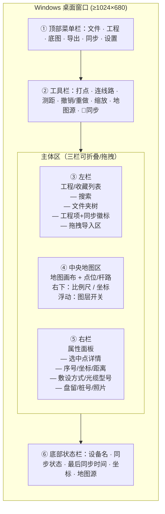
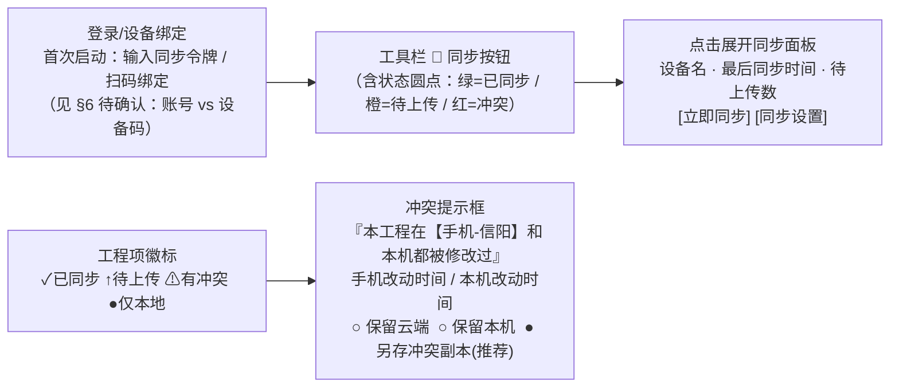

# PRD：滑洲云图 ovimap — Windows 桌面版 + Cloudflare 云同步

> 版本：v1.0（简单 PRD） · 作者：许清楚（Product Manager） · 状态：待架构师评审
> 范围：**仅** Windows 桌面端落地 + 工程文件云同步，**不做**竞品分析与市场调研

---

## 0. 项目信息

| 项 | 内容 |
|---|---|
| Language | 中文 |
| 现有技术栈 | Flutter 3.47.2 + `flutter_map ^8.0.0`（纯 Dart，原生支持 Windows） |
| 现有平台 | 仅 `android/`（**无 `windows/` 目录**） |
| 新增平台 | Windows 桌面（本地构建，主理人提供构建脚本） |
| 默认 UI 框架 | 沿用现有 Flutter/Material + 本 PRD 定义的桌面布局（不引入 MUI/Tailwind，本项目非 Web） |
| Project Name | `ovimap` |
| 同步后端 | Cloudflare（用户已有账号 + 已部署一个 Worker 反代） |
| 同步范围 | **仅工程文件**（点位/杆路/标注，几十 KB ~ 几 MB）；**不同步**大底图（GeoJSON 底图仍走手动文件传输） |

**原始需求复述**：用户是通信线路设计人员（河南信阳），工作流为「现场打点 → 自动连杆路算距离 → 一键导出 DXF 出图」。现有一台 Android 手机已装 ovimap；需新增 **Windows 电脑版**，并让手机与电脑像奥维地图一样**工程级协作同步**。已确认：电脑可本地构建 exe；同步后端用 Cloudflare；只同步轻量工程文件。

---

## 1. 产品定义

### 1.1 产品目标（3 条，正交）

| # | 目标 | 说明 |
|---|---|---|
| G1 | **室内精修工作站** | Windows 版让设计员在**大屏 + 鼠标 + 键盘**下精细编辑线路（杆路、桩号、配线、图例），并批量导出 DXF，解决手机小屏逐点操作低效的问题 |
| G2 | **现场/室内无缝接续** | 同一工程在手机与电脑间**跨设备续作**，对齐奥维体验：「手机改完 → 电脑打开即见；电脑改完 → 手机打开即见」 |
| G3 | **离线优先、弱网可靠** | 无网（山里、地下室）仍可正常采集与出图；联网后**自动补传**，任何一端都不丢数据 |

### 1.2 手机版 vs 电脑版分工

| 维度 | 手机版（现场） | Windows 版（室内） |
|---|---|---|
| 场景 | 野外/杆路现场采集 | 办公室/驻地精修出图 |
| 交互 | 竖屏、单手、GPS 打点、罗盘、拍照 | 横屏、多面板、鼠标、右键菜单、快捷键 |
| 强项 | 定位、打点、连线路、现场取证照片 | 批量编辑、桩号/配线精调、DXF 批量导出、底图矢量处理 |
| 定位 | 真实 GPS | **无 GPS/罗盘 → 降级为「手动落点 + 地图点选」** |

### 1.3 同步体验目标（对照奥维）

1. **改完就同步**：任一设备保存工程后，另一端在**联网且应用活跃**时 30 秒内可见（自动触发）。
2. **换设备就能看到**：打开应用 / 打开某工程时自动拉取最新，无需手动操作。
3. **不丢数据**：两端都改过同一工程时，**绝不静默覆盖**，必须让用户可感知、可恢复。

---

## 2. 用户故事（7 条，含异常场景）

| ID | 角色 | 故事 |
|---|---|---|
| US-1 | 设计员 | 我在**现场用手机打点连线**，回到办公室**打开电脑就能看到这条线路**，继续编辑/出图 |
| US-2 | 设计员 | 我在**电脑上精细调整杆路和桩号**，第二天去现场**用手机打开同一工程**继续采集 |
| US-3 | 设计员 | 我需要知道**这个工程最后一次是手机改的还是电脑改的**（设备名 + 时间），避免误覆盖对方的修改 |
| US-4 | 设计员 | 我在**没网的山里**采集完，回到有网的地方**自动同步**上去，无需记得手动点 |
| US-5 | 设计员 | 我在山里**弱网/断网**时点「同步」，应用应**明确告诉我失败了/排队中**，而不是假装成功 |
| US-6 | 设计员 | 我**手机和电脑同时改**了同一工程（例如同事帮忙在电脑上改了桩号），打开时应用要**提示冲突并让我选择保留哪份**，而不是丢掉一边 |
| US-7 | 设计员 | 我**误删了一个工程**，希望能从**云端历史版本**里找回来 |

---

## 3. 需求池（P0 / P1 / P2）

### 3.1 P0 — 必须（Must have）

#### P0-A Windows 桌面版可用

| 编号 | 需求 | 说明 |
|---|---|---|
| A1 | 生成 `windows/` 平台并编译出 **exe** | `flutter create --platforms=windows .`，产出可双击运行的 Release exe（含必要 DLL） |
| A2 | 核心能力 100% 保留 | 打点、自动连杆路、距离计算、**DXF 导出**（GBK / R12+R2000 / 链口径 / 桩号 / 配线走向 / 图例）、底图矢量导出、**GeoJSON 底图导入（含从文件选择）**、天地图/高德 Key 设置、地图源切换、瓦片缓存 |
| A3 | 插件平台适配 | 校验 `geolocator / flutter_compass / image_picker / path_provider / shared_preferences / share_plus / file_picker` 在 Windows 的行为；**无硬件能力（GPS/罗盘）降级**为「不可用 / 手动落点」 |
| A4 | 存储路径对齐 | `path_provider` 在 Windows 落到 `%APPDATA%/ovimap`（或文档目录），目录结构与 Android 的 `labels/`、`tiles/` 对齐，保证工程文件可直接互换 |

#### P0-B 桌面版 UI 适配

| 编号 | 需求 | 说明 |
|---|---|---|
| B1 | 窗口尺寸自适应 | 最小窗口 1024×680；面板可折叠/拖拽调宽；全屏/最大化正常 |
| B2 | 鼠标操作 | 左键点选/框选、滚轮缩放、拖拽平移、双击定位 |
| B3 | 右键上下文菜单 | 点位/线段/空白处分别提供「编辑、删除、插入点、设置敷设方式、复制坐标」等 |
| B4 | 快捷键 | `Ctrl+S` 保存、`Ctrl+Z/Ctrl+Y` 撤销重做、`Delete` 删除选中、`Ctrl+E` 导出 DXF、`Ctrl+F` 搜索定位 |
| B5 | 多面板布局 | 见 §4 设计稿（左：工程列表；中：地图；右：属性/点位详情） |

#### P0-C Cloudflare 云同步

| 编号 | 需求 | 说明 |
|---|---|---|
| C1 | 设备身份与鉴权 | 每台设备持有一个**设备码 + 同步令牌**；所有请求经 Cloudflare Worker 校验（复用已部署的反代 Worker） |
| C2 | 工程上传 / 下载 | 以**工程（collection）为最小同步单元**，服务端按工程保存快照 |
| C3 | 手动同步入口 | 顶部工具栏「同步」按钮 + 单工程右键「同步该工程」 |
| C4 | 自动同步（触发时机见下） | 启动/回前台拉取；打开工程时拉取；**保存后 debounce 30s 自动上传**；网络恢复自动补传 |
| C5 | 冲突处理 | 见 §3.3「冲突策略」 |
| C6 | 离线可用 | 无网时所有编辑照常落本地；同步任务进入**待上传队列**，联网后按序补传 |

**自动同步触发时机（明确定义）**：
| 时机 | 动作 |
|---|---|
| 应用启动 / 从后台回到前台 | 拉取「工程索引」（轻量，仅 id/名称/rev/updatedAt）比对差异 |
| 打开某个工程 | 拉取该工程最新版本（若服务端 rev 更新） |
| 本地保存工程后 | debounce 30 s 后自动上传（避免频繁写） |
| 网络从「无」变「有」 | 触发一次拉取 + 冲洗待上传队列 |
| 用户手动点「同步」 | 立即拉取索引并双向同步 |

#### P0-D 冲突处理策略（**建议方案**）

**结论：工程级「乐观并发 + 保守不覆盖 + 冲突副本」策略。**

机制：
- 每个工程在元数据中增加 `rev`（单调递增版本号）、`updatedAt`（毫秒时间戳）、`lastDeviceId`（最后修改设备）。
- 客户端上传时携带 **`baseRev`**（自己修改前的版本号）。服务端只有在 `baseRev == 当前服务端 rev` 时才接受覆盖并把 rev+1；否则返回 **409 冲突**。
- 冲突时**不自动覆盖**，弹出冲突框，提供三选一：
  1. **保留本机版本**（覆盖云端，rev+1）
  2. **保留云端版本**（丢弃本机改动，下载云端）
  3. **另存为冲突副本**（本机改动存成 `工程名(本机-手机 2025-xx-xx)` 新工程，云端保留）—— **默认推荐**
- 服务端**保留最近 N 个版本快照**（建议 N≥10），供 US-7 恢复。

**理由**：① 工程数据（点位/桩号/配线）是「成果物」，误覆盖的返工成本远高于多存一份副本，因此**保守优于激进**；② 目标是单人在多设备间协作，不是多人实时协同，**不需要**点级 CRDT/操作日志（成本高、收益低），工程级粒度已够用；③ 乐观并发锁（baseRev 校验）实现简单，能在 Cloudflare Worker + KV/D1 上轻量落地。

### 3.2 P1 — 应该（Should have）

| 编号 | 需求 | 说明 |
|---|---|---|
| P1-1 | **同步状态可视化** | 工程列表每项显示徽标：`已同步 ✓` / `待上传 ↑` / `有冲突 ⚠` / `仅本地`；顶部同步按钮显示汇总状态与最后同步时间 |
| P1-2 | **工程版本历史** | 右键工程 → 「历史版本」，可查看每个版本的修改设备/时间/点数，并**一键恢复**（防误删） |
| P1-3 | **桌面增强：拖拽导入** | 把 `.geojson` / `.dxf` / `.csv` 文件直接拖到地图区即导入底图或点位 |
| P1-4 | **桌面增强：批量导出** | 多选工程 → 一次性批量导出 DXF（各存子目录），适配「一天跑完多个工程统一出图」 |
| P1-5 | **桌面增强：工程文件关联** | 双击 `.ovimap`（或工程包）自动打开应用并载入该工程 |

> 判定：**不做**多窗口（价值低、Flutter 桌面多窗口成本高，留待 P2 观察）；**做**批量导出与拖拽导入，因其直接命中「室内批量处理」核心价值。

### 3.3 P2 — 可选（Nice to have）

| 编号 | 需求 | 说明 |
|---|---|---|
| P2-1 | 工程分享 | 生成只读分享链接或导出 `.ovimap` 工程包，发给同事/监理查看 |
| P2-2 | 图纸模板 / 图签自定义 | DXF 图例与标题栏模板可配置（单位名称、图号规则） |
| P2-3 | 批量处理 | 批量坐标纠偏、批量导出照片册/档案册 |
| P2-4 | PDF 导出预览 | DXF 之外增加 PDF 出图，便于直接打印/送审 |
| P2-5 | 照片同步（可选评估） | 现场取证照片（可能几十 MB）按需同步或走对象存储，默认**不同步** |

---

## 4. UI 设计稿

### 4.1 桌面版主界面布局（横屏多面板）

**与手机版的差异**：

| 维度 | 手机版 | Windows 版 |
|---|---|---|
| 方向 | 竖屏、单手 | 横屏、鼠标+键盘 |
| 导航 | Drawer 抽屉（`drawer_panel.dart`） | **常驻左栏**（工程列表）+ 顶部菜单栏 |
| 属性 | 弹窗/底部面板 | **常驻右栏**（边看边改） |
| 导出 | `export_center.dart` 全屏页 | 导出对话框 + 批量导出（P1-4） |
| 输入 | 触摸、GPS | 鼠标、右键菜单、快捷键 |

### 4.2 同步相关 UI

---

## 5. 验收标准（可检验）

| 编号 | 需求 | 验收标准（怎么算做完） |
|---|---|---|
| A1 | exe 可运行 | 在 Windows 上**双击 exe 能启动**并进入主界面，无崩溃 |
| A2 | 核心能力保留 | 在 Windows 上完成一次全流程：打 3 个点 → 自动连线路算距离 → **成功导出 DXF**（用 AutoCAD/看图工具打开正常显示桩号与图例）；导入一份 GeoJSON 底图成功叠加 |
| A3 | 硬件降级 | Windows 上 GPS/罗盘入口显示为「不可用/手动落点」，**不报错、不崩溃** |
| A4 | 路径对齐 | Windows 的工程目录结构（`labels/` 下 `index.json`、`collection_*.json`）与 Android 一致，导出后可直接拷到手机被识别 |
| B1-B5 | UI 适配 | 缩放窗口至最小 1024×680 布局不错乱；右键菜单可弹出；`Ctrl+S` 能保存；面板可折叠 |
| C1 | 鉴权 | 无有效令牌时同步请求被 Worker 拒绝（401）；有效令牌时成功 |
| C2/C3 | 上传下载 | 手机改一个点并保存 → **电脑端 30 秒内自动看到**该改动（或手动点同步后立即看到） |
| C4 | 自动同步 | 断开网络改点 → 联网后**无需手动操作，自动上传**，电脑端可见 |
| C5 | 冲突 | 两端在离线态各改同一工程 → 联网后弹出冲突框；选「另存冲突副本」后，云端工程与本机副本**都保留**，无数据丢失 |
| C6 | 离线可用 | 飞行模式下可正常打点、连杆路、导出 DXF；待上传队列在状态栏可见；恢复网络后队列自动清空 |
| P1-1 | 状态可视化 | 工程列表正确显示四种徽标之一，且与实际同步状态一致 |
| P1-2 | 版本历史 | 删除工程后能从历史版本恢复出完整点位 |

---

## 6. 待确认问题（需用户 / 架构师澄清）

| # | 问题 | 影响 | 建议倾向 |
|---|---|---|---|
| Q1 | **账号体系 vs 设备码**？ | 决定 C1 鉴权实现复杂度 | 单人场景建议**轻量设备码 + 同步令牌**，不做完整登录/注册（可选扫码绑定） |
| Q2 | **Cloudflare 存储选型**？KV / D1 / R2 | 决定服务端数据结构 | 工程几十 KB~几 MB 建议 **R2(存快照) + D1(存索引/rev)** 或 KV 起步 |
| Q3 | **工程文件是否可加字段**（`rev`/`updatedAt`/`lastDeviceId`）？ | 决定冲突检测可行性 | 建议加；需验证**旧版 Android 读到新字段能被忽略**（向后兼容） |
| Q4 | **当前草稿 `draft.json` 是否同步**？ | 防「未保存为工程」的数据丢失 | 建议同步，或保存工程时强提示 |
| Q5 | **冲突合并粒度**：工程级 还是 点级？ | 决定是否需 CRDT/操作日志 | 建议**工程级**（成本低、够用）；点级留 P2 |
| Q6 | **照片 `photos/` 是否同步**？ | 数据体积 | 用户已明确「只同步工程文件」→ 默认**不同步**，跨端缺图以占位符显示 |
| Q7 | 现有多工程是否已有稳定 `id`/`createdAt` 结构可直接复用？ | 决定索引格式 | 现有 `CollectionMeta{id,name,createdAt,...}` 可复用，需**新增 `updatedAt`/`rev`** |
| Q8 | Windows 端 `image_picker` 拍照替代方案（电脑无摄像头/需选已有文件）？ | 现场取证照片补录 | 建议降级为**文件选择导入**，与手机照片靠文件名对齐 |
| Q9 | 同步是否需**多用户/共享工程**（同事协作）？ | 若有则冲突模型需升级 | 当前按**单人单账号多设备**设计；多用户归 P2 |
| Q10 | DXF 导出在图示/验收上是否有既定规范（图签、图层名）需 Windows 端一并满足？ | 影响导出验收 | 沿用现有 `dxf_layers`/`dxf_version` 逻辑，不新增规范 |

---

## 附：数据与同步单元说明（给架构师的最小上下文）

- 现状持久化（`lib/services/store.dart`，本地 JSON，无 DB）：
  - `labels/draft.json` —— 当前草稿（labels + projectName + folderId）
  - `labels/index.json` —— 工程收藏索引（`CollectionMeta` 列表：id/name/kind/count/folder/createdAt…）
  - `labels/collection_<id>.json` —— 单个工程的完整点位（`MapLabel` 列表）
  - `labels/folders.json`、`labels/photos/`、`labels/basemap/`、`tiles/`
- **建议同步单元**：单个 `collection_<id>.json` + 其索引条目；**索引整体**在启动时轻量比对（仅 id/rev/updatedAt），避免全量传输。
- **需新增字段**：工程级 `rev`（int）、`updatedAt`（ms）、`lastDeviceId`（string），用于冲突检测与状态展示。
- 底图 `basemap/`、瓦片 `tiles/`、照片 `photos/` **不纳入本次同步**（用户已决策）。
