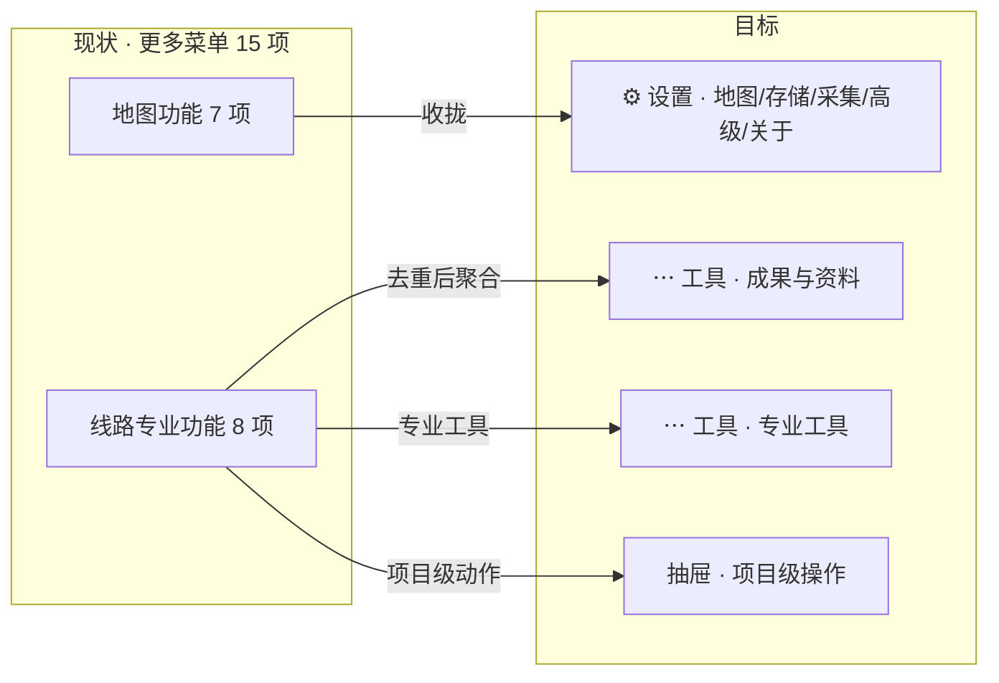

# 滑洲云图 ovimap — 增量 PRD（v1.0）

> 类型：**增量 PRD**（只描述本次变更，不重写全量需求）
> 产出人：产品经理 许清楚　|　交付对象：架构师 / 团队主理人
> 定位：面向**通信线路工程**（外业勘察设计 + 竣工测量结算）的 Android 单机 App（个人自用，可离线）
> 技术底座：Flutter 3.x + flutter_map 8 + provider

---

## 0. 原始需求复述

> 接着优化、接着迭代升级，删除重复和无用的功能和菜单；把自己当成一名通信线路设计人员兼竣工结算人员，希望这款软件有什么功能、什么逻辑、什么界面，能帮自己减少设计工作量和竣工工作量。

**一句话目标**：把菜单**做减法**（去掉重复/低频噪音），把业务**做加法**（用手上已有的打点数据自动产出设计图和结算资料），让"少点几下、少算几遍"。

**本次迭代主题**：`收敛入口 · 自动出成果`。

---

## 1. 现状勘察结论（写方案前先对齐事实）

对 `lib/` 源码核对后，发现**能力比菜单呈现出来的要多**，很多"想加的功能"其实已经有了，只是**藏得深、入口乱、有重复**。这是本次清理的根因。

| 能力 | 现状位置 | 说明 |
|---|---|---|
| 统一导出面板 `showExportDialog` | drawer 导出 / 拓扑导出 / 更多·导出草稿 **三处**调用同一个面板 | 已含 **7 种**导出：DXF 路由图、KML、杆点坐标 CSV、**芯线占用表 CSV（含校验）**、配线拓扑图 PNG、**材料统计表 CSV**、**工程量清单 CSV（451 号文口径）** |
| 竣工对比设计 | 抽屉·每项「竣工对比设计」→ `CsvExporter.exportDesignDiff` | **已存在**：杆位增/删/偏移 + 同名相邻杆段距对比 CSV |
| 竣工照片册 ZIP | 更多·「打包竣工照片册」→ `photo_book.dart` | 已存在 |
| 杆路轨迹核查 | 更多·「杆路轨迹核查」→ `track_check.dart` | 已存在：查漏杆/错位 |
| 批量显隐 | 抽屉·文件夹级 | 已存在 |
| 快捷标注（埋/管/吊/架/钉/槽/桥/顶棚/暗/竖 + 数字） | 属性编辑内 | 已存在 |

> ⚠️ **给架构师的关键结论**：P0 里的多项需求属于「**聚合 + 打包 + 界面收敛**」，底层数据模型（`MapLabel`：类型/线组/段距/盘留/光缆型号/敷设方式/管孔/分光比/照片）与导出器（`csv.dart` / `dxf.dart` / `photo_book.dart`）**已具备**，无需新建数据字段，改造风险低。

---

## 2. 【清理清单】删除 / 合并 / 收拢

**动作图例**：`删`＝直接移除　`并`＝合并到其它入口　`收`＝收进「设置」　`留`＝保留但调整位置

### 2.1 「更多」菜单 · 地图功能（7 项 → 收拢为「设置」）

| # | 现状位置 | 建议动作 | 理由 | 影响面 |
|---|---|---|---|---|
| 1 | 更多·坐标格式切换 | **收** → 设置·地图 | 一次性偏好，占业务菜单 | 低（仅入口迁移） |
| 2 | 更多·坐标系说明 | **并** → 设置·关于/帮助 | 说明类，非功能 | 低 |
| 3 | 更多·天地图 Key 设置 | **收** → 设置·地图 | 首次配置一次，几乎不再点 | 低 |
| 4 | 更多·清理当前图源缓存 | **收** → 设置·存储管理 | 低频维护动作 | 低 |
| 5 | 更多·清理未引用照片文件 | **收** → 设置·存储管理 | 与 4 同类，合并为一个"清理"入口 | 低 |
| 6 | 更多·恢复出厂地图设置 | **收** → 设置·高级（加二次确认） | 一次性、危险操作，不该在一级 | 低 |
| 7 | 更多·关于滑洲云图 | **留**（移设置底部） | 保留但要沉底 | 无 |

### 2.2 「更多」菜单 · 线路专业功能（8 项 → 去重后重排）

| # | 现状位置 | 建议动作 | 理由 | 影响面 |
|---|---|---|---|---|
| 8 | 更多·采集设置（杆路自动编号） | **收** → 设置·采集 | 低频配置 | 低 |
| 9 | 更多·拓扑连线指引 | **并** → 拓扑模式的 HUD「?」帮助 | 上下文帮助应出现在使用它的场景里 | 低（新增 HUD 帮助按钮） |
| 10 | 更多·杆路点表 | **留** → 「成果/资料」入口 | 高频查询，保留但归位 | 低 |
| 11 | 更多·导入 KML 到当前项目 | **并** → 统一「导入」入口 | 与 12 同属导入，聚合 | 低 |
| 12 | 更多·导入箱体节点到当前项目 | **删（去重）** → 保留抽屉·每项「导入箱体节点」 | **与抽屉入口完全重复**，两个出口干同一件事 | 低（删一个出口） |
| 13 | 更多·打包竣工照片册 ZIP | **并** → 「竣工资料一键成册」 | 作为成册的一个组成部分，不再单列 | 中（并入 P0-3） |
| 14 | 更多·杆路轨迹核查 | **留** → 「专业工具」分组 | 竣工核查刚需，保留 | 低 |
| 15 | 更多·导出当前草稿成果 | **并** → 统一「导出成果」入口 | **与抽屉导出、拓扑导出重复** | 低 |

### 2.3 重复出口专项核查（本次重点）

| 功能 | 现存出口 | 结论 |
|---|---|---|
| **导出成果**（同一 `showExportDialog`） | ①更多·导出当前草稿成果 ②拓扑模式·导出 ③抽屉·每项导出 ④抽屉·全部 KML 导出 | **③④保留**（收藏级/批量级语义不同）；**①②合并**为上下文感知的单一「导出成果」（编辑时=草稿，拓扑时=配线），出口从 4 → 3 |
| **导入箱体节点** | ①更多菜单 ②抽屉·每项 | **删①，留②** |
| **KML 导入** | ①更多·导入 KML | 保留，整合进统一「导入」 |
| **与 GPS/定位相关** | 右侧栏·◎定位　‑　底部·「我在这」 | 语义不同（跟随 vs 跳转打点），**保留两者**，但统一图标/文案避免误解 |
| **保存** | 编辑模式·保存收藏　‑　测量模式·保存　‑　轨迹·保存 | 各自模态上下文，**保留** |
| **属性编辑** | 双击点位弹窗　‑　底部·属性　‑　杆路点表 | 保留，但**统一样式与字段**（见 P0-4） |

### 2.4 低频 / 价值复核（用户点名要求判断）

| 功能 | 真实价值判断 | 建议 |
|---|---|---|
| **离线地图** | **高**——信阳郊野外业常无信号，出行前预下载是刚需；但它是**出行前一次性动作**，非每分钟操作 | 保留能力，**从右侧栏常驻移入「设置·离线地图」**，右侧栏腾出位置 |
| **测面积** | **中低**——线路工程以线性里程为主，面积仅用于施工范围/占地 | 保留在「测量」弹出菜单内，**测距为默认、测面积为次级**，不上升为一级 |
| **恢复出厂地图设置** | **极低**（一次性、且危险） | 收进设置·高级 + 二次确认 |
| **清理缓存 / 未引用照片** | **低**（维护型） | 合并为设置·「存储清理」一个入口 |
| **坐标系说明 / 关于** | **低**（说明型） | 收进设置·关于 |

### 2.5 清理收益小结

- 「更多」菜单：**15 项 → 约 6 项**（成果 2 + 专业工具 3 + 设置入口 1），业务菜单不再被工具设置挤占。
- 一级导出出口：**4 → 3**；箱体导入：**2 → 1**；清理类入口：**3 → 1**。
- 右侧栏：**8 → 7**（移除离线常驻）。

---

## 3. 【双视角功能规划】

### 3.1 设计人员视角 —— 外业勘察打点 → 内业成图 → 出图交底

| # | 最痛的点（真实工作流） | 映射软件功能 | 减少哪部分工作量 |
|---|---|---|---|
| D1 | 一基杆一基杆点，长路由几百杆全靠手点 | **常用档距自动布杆**：给定起/止点与平均档距（如 50m），按方向自动插杆，落点可再微调；复用现有 `MapLabel` 杆路类型 + 线组 + 自动编号 | 外业/内业**打点量 ↓80%** |
| D2 | 光缆用量、路由长度、按型号芯公里要手工在 Excel 里算 | **路由长度与光缆用量自动测算**（已有 `exportMaterialStats` 基础）：按段敷设方式/型号汇总 + 盘留合计，图上可即时查看 | 内业**算量 ↓100%**（原全手工） |
| D3 | 换一个工程要重设一遍符号/样式/敷设方式，图例不统一 | **典型工程模板库**：预置"架空光缆/管道光缆/箱体配线"模板（默认符号集、线色、敷设方式），新工程一键套用 | 建库/统一图例**时间 ↓** |
| D4 | 出 DXF 要为每个图层反复勾选、桩号/距离/型号标注逐项确认 | **出图预设记忆**（已有 `showDxfOptions` 选项记忆基础）：把常用勾选存为"交底图/路由图"两个预设，一键出图 | 出图操作**步数 ↓** |
| D5 | 设计变更时，一批杆的敷设方式/型号/盘留要逐个改属性 | **批量属性编辑**（按线组 / 框选）：一次性设置敷设方式、光缆型号、盘留、桩号前缀 | 改图**时间 ↓90%** |

### 3.2 竣工结算人员视角 —— 竣工丈量 → 变更比对 → 资料编制 → 结算工作量表

| # | 最痛的点（真实工作流） | 映射软件功能 | 减少哪部分工作量 |
|---|---|---|---|
| C1 | 竣工要和设计逐杆逐段比对增/删/偏移，人工找差异 | **设计↔竣工变更对照清单**（已有 `exportDesignDiff` 基础，增强为可读清单 + 变更量汇总 + 可导出） | 比对**时间 ↓**、漏项 ↓ |
| C2 | 结算要按定额口径出工作量表，逐项抄数量 | **工程量清单表**（已有 `exportBoq` 451 口径，增强按型号/杆型拆分） | 编制**工作量 ↓** |
| C3 | 交结算要凑齐"图 + 照片 + 表"，散在多个导出里 | **竣工资料一键成册**：DXF 路由图 + 工程量清单 + 材料统计 + 照片册 → 一个 ZIP，带项目信息头 | 资料编制**打包 ↓100%** |
| C4 | 光缆用量要按型号汇总芯公里，手工乘芯数 | **材料汇总表**（已有 `exportMaterialStats`）：按型号汇总长度/芯线公里 + 盘留 | 材料表**算术归零** |
| C5 | 走查后怀疑漏杆/打偏，回内业逐杆核 | **杆路轨迹核查**（已有 `track_check`）：一键生成核查报告（漏杆/错位清单 + 定位） | 复核**时间 ↓** |

> 说明：C1–C5 五项中，**底层能力 4 项已存在**，本次价值在"**从 CSV 升级为可读清单 + 汇总 + 打包**"。

---

## 4. 【信息架构 / 界面重构】

### 4.1 目标原则

1. **常用一眼可见**：编辑/测量/轨迹/定位始终在右侧栏。
2. **低频收进设置**：一次性、维护型、说明型全部沉到「设置」。
3. **单一出口**：同类动作只有一个入口（导出、导入、清理各一）。
4. **上下文帮助**：指引类内容放到使用它的模式里（拓扑指引 → 拓扑 HUD）。

### 4.2 各区域重排

| 区域 | 现状 | 目标 | 变更说明 |
|---|---|---|---|
| **顶部栏** | 菜单 + 搜索 + 图层 | 菜单 + 搜索 + 图层（不变） | 保留；搜索框已支持"地点/经纬度"，够用 |
| **右上罗盘** | 点按回正北 | 不变 | — |
| **右侧栏** | ＋－ / ✚标记 / ⌖测量 / ∿轨迹 / ◎定位 / ⇩离线 / ⋯更多（8） | ＋－ / ✚标记 / ⌖测量 / ∿轨迹 / ◎定位 / ⋯工具 / ⚙设置（7） | **移除 ⇩离线常驻**（→设置）；**更多 → 工具**；**新增 ⚙设置** |
| **「工具」面板**（原更多） | 地图功能7 + 专业功能8 | ①成果与资料：导出成果、导入、杆路点表、竣工资料成册 ②专业工具：采集设置、轨迹核查、拓扑指引 | 15 → 约 6；地图类全部移出 |
| **「设置」面板**（新增） | —（散落在更多里） | 地图（坐标格式/图源/天地图Key/离线地图）、存储管理（清缓存/清照片）、采集（自动编号）、高级（恢复出厂）、关于 | 低频集中收纳 |
| **底部工具条** | 编辑/测量/拓扑/轨迹 各自一组 | 不变（结构合理） | 仅拓扑组「导出」→ 调用统一导出 |
| **左侧抽屉** | 文件夹 + 收藏项（含导出/对比/导入箱体） | 不变，作为"项目级"操作中心 | 保留，作为唯一箱体导入出口 |

### 4.3 目标信息架构（文字树）

```
滑洲云图 ovimap
├─ 顶部栏
│   ├─ ☰ 收藏夹抽屉
│   ├─ 🔍 搜索地点 / 经纬度
│   └─ ▤ 图层 / 图源
├─ 右侧栏（常用一眼可见）
│   ├─ ＋ / －            缩放
│   ├─ ✚ 标记             编辑 ⇄ 普通（设计/竣工切换在编辑底栏）
│   ├─ ⌖ 测量             测距（默认）/ 测面积
│   ├─ ∿ 轨迹             记录 / 暂停 / 结束
│   ├─ ◎ 定位             跟随 / 我在这
│   ├─ ⋯ 工具（低频业务）
│   │   ├─ 成果与资料：导出成果 · 导入(KML/箱体) · 杆路点表 · 竣工资料一键成册
│   │   └─ 专业工具：采集设置 · 杆路轨迹核查 · 拓扑连线指引
│   └─ ⚙ 设置（低频维护）
│       ├─ 地图：坐标格式 · 图源 · 天地图 Key · 离线地图
│       ├─ 存储：清理缓存 · 清理未引用照片
│       ├─ 采集：杆路自动编号
│       ├─ 高级：恢复出厂地图设置
│       └─ 关于 / 坐标系说明
├─ 右上角：罗盘（点按回正北）
├─ 底部工具条（随模式变化）
│   ├─ 编辑：设计模式 / 竣工模式 · 撤销 · 清空 · 我在这 · 属性 · 保存收藏
│   ├─ 测量：撤销 · 保存 · 完成
│   ├─ 拓扑：撤销连线 · 导出（→统一导出）· 完成
│   └─ 轨迹：暂停/继续 · 结束
└─ 左侧抽屉（项目级操作中心）
    └─ 文件夹 ▸ 收藏项：打开 · 导出 · 拓扑 · 显隐 · 重命名 · 移动 · 线条样式
                      · 项目描述 · 删除 · 导入箱体节点 · 竣工对比设计
```

### 4.4 清理前后对照（Mermaid）



---

## 5. 【需求池】

### 5.1 P0 —— 本迭代落地（5 项，真正减少工作量）

#### P0-1｜统一「成果中心」（收敛导出 + 去重导入）
- **用户故事**：作为既做设计又做竣工的人，我希望所有"导出/导入"只有一个入口，这样我不用在想导出时先回忆"它在哪个菜单"。
- **验收标准**：
  1. 编辑模式下只有一个「导出成果」入口，点开即导出**当前草稿**；拓扑模式下同一入口导出**配线成果**。
  2. 「更多」中的"导出当前草稿成果"、拓扑"导出"不再各自独立，均指向该入口。
  3. 删除「更多·导入箱体节点」，箱体导入**仅保留抽屉入口**，功能不回退。
  4. 导出面板仍含现有 7 种类型（DXF/KML/杆点CSV/芯线占用表/拓扑PNG/材料统计/工程量清单），一个不缺。
- **复用**：`showExportDialog`、`CsvExporter`、`KmlExporter`、`DxfExporter` 原样复用。

#### P0-2｜批量属性编辑（按线组 / 框选）
- **用户故事**：作为设计人员，改一段路由的敷设方式/光缆型号/盘留时，我希望一次改一整段，而不是逐点改。
- **验收标准**：
  1. 可选中"一条线组"或"框选范围内的点"，对选中集批量设置：敷设方式（架空/埋地/管道）、光缆型号（`segCable`）、盘留（`slackM`）、桩号前缀。
  2. 批量操作**进入全局撤销栈**，可一次撤销。
  3. 批量修改后，`exportMaterialStats` / `exportBoq` 的分段长度、材料统计随之变化，数值正确。
- **复用**：`MapLabel.segKind/segCable/slackM`、`buildLabelChains`、现有撤销机制。

#### P0-3｜竣工资料一键成册（ZIP）
- **用户故事**：作为竣工结算人员，交资料时我希望一键生成一个包含"图 + 表 + 照片"的压缩包，而不是分别导出再拼凑。
- **验收标准**：
  1. 选择一个收藏工程 → 一键生成 ZIP，内含：DXF 路由图、工程量清单 CSV、材料统计 CSV、竣工照片册（照片 + 索引）。
  2. 包内附「项目信息.txt/说明页」：工程名、点位数、总里程、生成时间。
  3. 生成后可直接系统分享（复用现有 `shareFile`）。
  4. 缺项（如无照片）不报错，跳过并在说明页标注。
- **复用**：`DxfExporter` / `CsvExporter.exportBoq` / `exportMaterialStats` / `photo_book.dart` + 打包（新增 ZIP 组装逻辑，仅此一处）。

#### P0-4｜设计 ↔ 竣工变更对照清单（增强）
- **用户故事**：作为竣工结算人员，我希望竣工工程与设计工程一键比对，直接看到增杆/删杆/偏移杆和段距变化及**变更量**，而不是手工找差异。
- **验收标准**：
  1. 选定"竣工工程"与"设计工程"后，生成可读清单：**新增杆位 / 删除杆位 / 位置偏移超阈值的杆 / 同名相邻杆段距变化**。
  2. 清单头部给出**变更量汇总**（增杆数、删杆数、偏移数、净长度差）。
  3. 可导出（复用现有 CSV 口径），并支持"仅看变更项"过滤。
  4. 对齐偏差阈值可设（默认如 1m）。
- **复用**：`CsvExporter.exportDesignDiff`、`store.loadCollection`。

#### P0-5｜常用档距自动布杆 + 典型模板库
- **用户故事**：作为设计人员，点长路由时我希望输入平均档距就自动按方向布杆，并用工程模板一键统一符号与敷设方式。
- **验收标准**：
  1. 给定起点、终点点位与平均档距（默认 50m），自动沿线等距插入杆路点，命名接续现有自动编号规则（`GK-n`）。
  2. 布杆结果进入撤销栈；落点可后续拖动微调（复用拖动点位）。
  3. **模板库**：预置"架空光缆 / 管道光缆 / 箱体配线"3 个模板（符号集 + 线色 + 默认敷设方式）；新建工程可一键套用。
  4. 模板不改变 `MapLabel` 已有字段语义，仅设置默认值。
- **复用**：`AppState.addLabel` + 自动编号、`LabelType`、`GeoUtil` 距离计算。

> **P0 依赖提示（给架构师）**：P0-3 依赖 P0-1 的成果面板作为入口；P0-2 需先有"选择集"概念（线组已存在，框选需新增）；P0-5 的自动布杆为唯一"新算法"项，其余均为聚合/增强。

### 5.2 P1 —— 下一迭代

| ID | 需求 | 价值 | 备注 |
|---|---|---|---|
| P1-1 | 路由长度 / 光缆用量**图上即时显示**（不导出也能看） | 设计内业提速 | 复用材料统计算法 |
| P1-2 | DXF **出图预设**（交底图/路由图两套勾选记忆） | 出图提效 | 已有选项记忆基础 |
| P1-3 | 杆路点表**内嵌编辑**（表内直接改属性/跳转） | 内业批改 | 已有杆路点表基础 |
| P1-4 | DXF 图幅**分幅与图框**（大路由按图幅自动裁切） | 出图规范 | 新算法 |
| P1-5 | 芯线占用表**可视化提示**（超芯告警定位到点） | 减少返工 | 已有校验逻辑 |

### 5.3 P2 —— 远期

| ID | 需求 | 备注 |
|---|---|---|
| P2-1 | 对接通算宝 / 451 预算引擎（深度造价） | 需外部接口，先确认 |
| P2-2 | 多工程 / 多段落合并出图与合并统计 | 待确认需求 |
| P2-3 | 竣工资料成册套用**甲方模板**（封面/目录样式） | 待确认模板来源 |
| P2-4 | 照片 EXIF 位置校核（照片与点是否一致） | 复用照片+坐标 |
| P2-5 | 语音/快捷手势打点（外业戴手套场景） | 体验增强 |

---

## 6. 【待确认问题】

| # | 问题 | 为什么要用户拍板 | 默认建议 |
|---|---|---|---|
| Q1 | 是否需要**对接通算宝 / 451 预算引擎**，还是现有 451 口径 CSV 够用？ | 决定 P2-1 是否立项、是否有数据接口 | 先用 CSV 口径，接口后置 |
| Q2 | **是否需要多工程合并出图/合并统计**（一个项目跨多路段）？ | 决定是否引入"工程组"概念，影响数据模型 | 暂不做，单工程为主 |
| Q3 | 「设计版 / 竣工版」是否就用**两个收藏工程对比**（现状），还是要同一工程内双版本？ | 影响 `store` 与对比逻辑改造成本 | 沿用"两收藏对比"（零改造） |
| Q4 | 自动布杆的**默认档距与杆型规格**（如 50m / 8m 杆）以哪个为准？ | 决定 P0-5 默认值 | 默认档距 50m、可改 |
| Q5 | 离线地图是否需要**区域预下载**（框选范围缓存），还是整图源缓存够用？ | 决定离线下载 UI 复杂度 | 先做整图源，区域下载列 P1 |
| Q6 | 竣工对比的**偏移阈值**默认取值（1m / 2m / 比例）？ | 影响变更清单结果 | 默认 1m，可调 |

---

## 7. 交付物清单（本次）

1. 本文件：`docs/sop/01-增量PRD.md`
2. 核心结论：**清理 15→6 项菜单；收敛 4→3 导出出口；P0 五项聚焦"自动出成果"**，且其中多项复用现有导出器与 `MapLabel` 字段，改造风险低。

> 可直接交由架构师做任务分解。P0-1 / P0-3 / P0-4 为强关联簇（成果中心 → 成册 / 对比），建议同迭代内串行推进。
