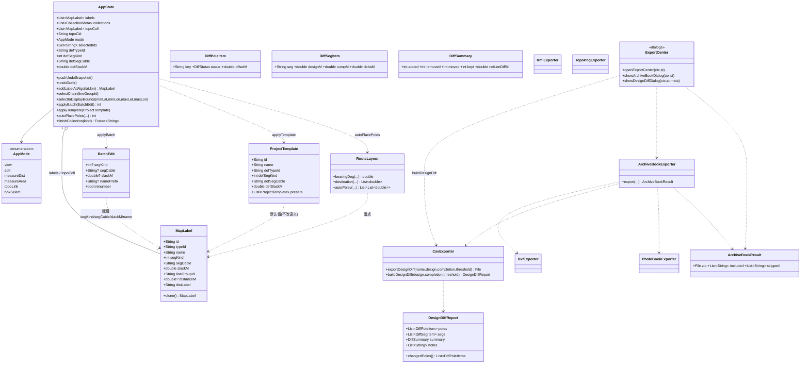
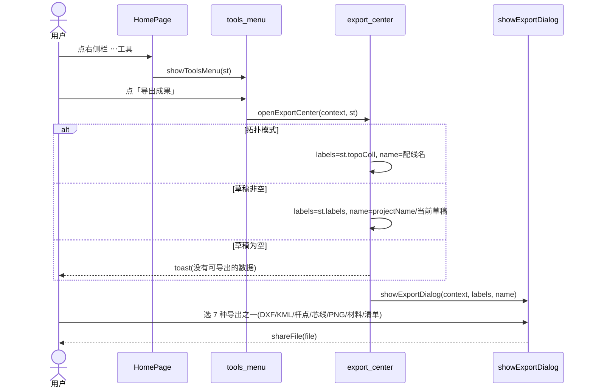
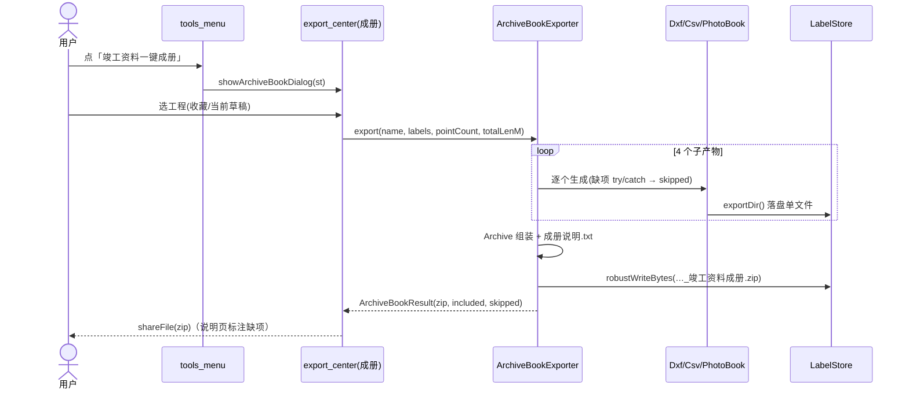
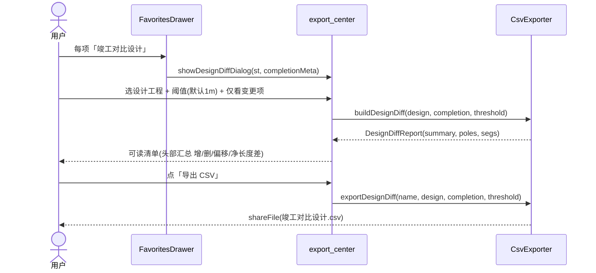
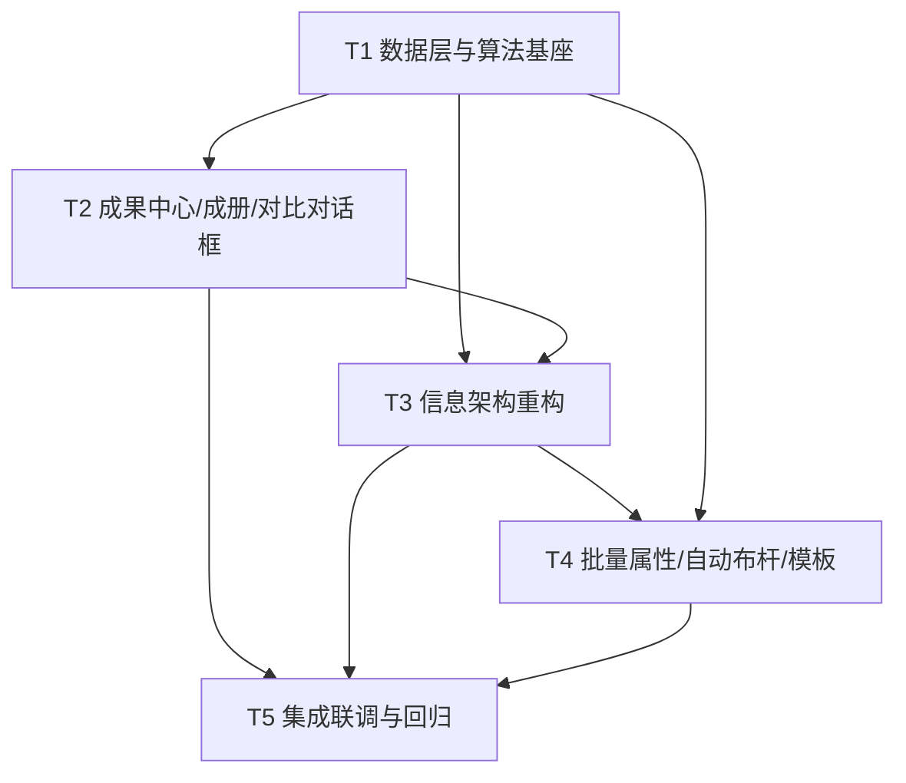

# 滑洲云图 ovimap — 增量技术设计 + 任务分解（v1.0）

> 类型：**增量设计**（只描述本迭代变更，不重写全量架构）
> 产出人：架构师 高见远　|　输入：`docs/sop/01-增量PRD.md`（许清楚）
> 交付对象：软件工程师（按 T1→T5 顺序实现）、团队主理人
> 技术底座：**Flutter 3.x + flutter_map 8 + provider**（已定，不得引入新重型依赖）
> 本迭代范围：**P0-1 ~ P0-5 + 菜单清理**，原则 **最小变更 · 复用优先 · 不回归**。

---

## 0. 设计总纲（给工程师的 3 句话）

1. **能复用就不新建**：P0-1/3/4 的底层导出器（`dxf.dart`/`csv.dart`/`photo_book.dart`）、`MapLabel` 字段（`segKind/segCable/slackM/lineGroupId`）、撤销栈（`pushUndoSnapshot/undoDraft`）、统一面板 `showExportDialog` **全部已具备**，本迭代主要做 **聚合 + 上下文感知 + 界面收敛**。
2. **唯一"新算法"只有一个**：P0-5 的**等距自动布杆**（`RouteLayout.autoPoles`），独立成 `lib/geo/route_layout.dart`，纯函数、可单测。
3. **唯一"新交互"只有一个**：P0-2 的**框选**（新增 `AppMode.boxSelect`），线组选择复用现有 `buildLabelChains` 与 `_hitTestGeo`。

---

## 1. 实现方案（逐项 P0）

### P0-1 统一「成果中心」（收敛导出 + 去重导入）

**现状**：同一个 `showExportDialog(context, labels, name)` 有 **4 个出口**——①更多·导出当前草稿 ②拓扑模式·导出 ③抽屉·每项导出 ④抽屉·全部KML。其中 ①② 语义重复（都是"当前上下文成果"）。

**落地方案**
- 新增 **上下文感知入口** `openExportCenter(BuildContext, AppState)`（放在新文件 `lib/ui/export_center.dart`）：
  - `mode == AppMode.topoLink` → `labels = st.topoColl`，`name = await store.loadCollectionName(st.topoCid)`（默认"配线"）；
  - 否则草稿非空 → `labels = st.labels`，`name = st.projectName 或 '当前草稿'`；
  - 草稿为空 → `toast('没有可导出的数据')` 直接返回。
  - 内部**原样调用** `showExportDialog`（7 种导出一个不动）。
- `⋯工具·成果与资料 →「导出成果」` 调 `openExportCenter`；**拓扑底栏「导出」也改为** 调 `openExportCenter`（删除原内联 `showExportDialog` 调用）。
- **删除** `_moreMenu` 里的 `导入箱体节点到当前项目` 与 `导出当前草稿成果` 两项（连同 `_showImportBoxesToDraftDialog/_confirmImportToDraft` 死代码）；箱体导入**只保留抽屉** `FavoritesDrawer._showImportBoxesDialog`。
- 抽屉 `③ 每项导出`、`④ 全部KML` **保留**（项目级/批量级语义不同）。

**为何最小变更**：`showExportDialog` 签名 `(context, List<MapLabel>, String)` 完全不变；只是把"谁在什么上下文调它"收敛到一个包装函数，导出器零改动，7 种导出零风险。

### P0-2 批量属性编辑（按线组 / 框选）

**现状**：无"选择集"概念；线组已存在（`buildLabelChains`）；逐点改属性已存在（`showLabelProperties`）。

**落地方案**
- **状态层**（`app_state.dart`）新增选择集与批量应用：
  - `final Set<String> selectedIds = {}`（草稿点的 id 集合）。
  - 新增 `AppMode.boxSelect`（枚举加一个值 → 编译器强制你补全 3 处 `switch`，不会漏）。
  - `selectChain(String lineGroupId)`：把该线组所有点选入（复用 `buildLabelChains(st.labels)` 找组）。
  - `selectInDisplayBounds(minLat,minLon,maxLat,maxLon)`：框选落点用（显示坐标系判交，见 §4 时序 B）。
  - `int applyBatch(BatchEdit e)`：**先 `pushUndoSnapshot()` 一次**，再对 `selectedIds ∩ labels` 逐点赋值，`_saveDraft(); notifyListeners();` —— 因此**一次可撤销**。
- **模型层**（`lib/models/diff_report.dart` 旁或独立）新增 `BatchEdit`（可空字段=不改）：
  ```dart
  class BatchEdit {
    final int? segKind;        // 0默认/1架空/2埋地/3管道；null=不改
    final String? segCable;    // ''=清空；null=不改
    final double? slackM;      // null=不改
    final String? namePrefix;  // 命名/桩号前缀；null=不改
    final bool renumber;       // true=按前缀重编号 name = '前缀-n'
    const BatchEdit({this.segKind, this.segCable, this.slackM,
                     this.namePrefix, this.renumber = false});
    bool get isEmpty => segKind==null && segCable==null
                        && slackM==null && namePrefix==null;
  }
  ```
- **交互层**（新文件 `lib/ui/batch_edit.dart`）：
  - `showBatchEditDialog(context, st)`：预览选中数；表单含 敷设方式(含"不改")、光缆型号(含"不改")、盘留(含"不改")、命名前缀(含"不改/仅改前缀不重编号")；确定 → `st.applyBatch(...)`。
  - 线组选择：编辑底栏加「批量」→ 弹层两选：**「选整条线组」**（列 `buildLabelChains` 各链，点一条即 `selectChain`）或 **「进入框选」**（`setMode(boxSelect)`）。
  - 框选：`HomePage` 在 `mode==boxSelect` 时叠一个 `Positioned.fill` 的 `GestureDetector(opaque)` + `CustomPaint` 画选框，`onPanEnd` 把屏幕角点转经纬（`MapCamera.screenOffsetToLatLng`）→ `st.selectInDisplayBounds(...)`；底栏显示"已选 n 点 · [设置属性][清空][完成]"。

**为何最小变更**：数据字段零新增（`segKind/segCable/slackM` 已有，材料统计/工程量表**已按这些字段计算**，改了自然联动）；撤销复用现有快照栈；线组选择零新算法。

### P0-3 竣工资料一键成册（ZIP）

**现状**：`PhotoBookExporter.export` 已能出**照片册 ZIP**；`DxfExporter`/`CsvExporter.exportBoq`/`exportMaterialStats` 已能出单文件；`share_plus` 已可分享。

**落地方案**：新增 `lib/export/archive_book.dart` → `class ArchiveBookExporter`：
```dart
class ArchiveBookResult {
  final File zip;
  final List<String> included; // ['路由图.dxf','工程量清单.csv',...]
  final List<String> skipped;  // ['照片册（无挂接照片）', ...]
  ArchiveBookResult(this.zip, this.included, this.skipped);
}

class ArchiveBookExporter {
  /// 一键成册：DXF 路由图 + 工程量清单 + 材料统计 + 照片册，附「成册说明.txt」。
  /// 缺项 try/catch 逐个跳过，不抛错，写入 skipped 并在说明页标注。
  static Future<ArchiveBookResult> export({
    required String name,
    required List<MapLabel> labels,
    String folderId = '',
    int pointCount = 0,
    double totalLenM = 0,
    String editMode = 'completion',
  }) async { /* ... */ }
}
```
- 实现要点：逐个生成子文件（每次 `try/catch`，失败/无数据→记 `skipped` 并继续），读取字节喂给 `Archive()`（`archive` 包，**已是依赖**），最后 `ZipEncoder().encode` + `robustWriteBytes` 写 `…_竣工资料成册.zip`。
- 「成册说明.txt」内容：工程名、点位数、总里程（`Σ 段距`，口径同 `CsvExporter`）、生成时间、`included/skipped` 清单。
- **UI**：`lib/ui/export_center.dart` 内 `showArchiveBookDialog(context, st)`：列 `st.collections`（可选"当前草稿"），选一个 → `ArchiveBookExporter.export` → `shareFile`。入口在 `⋯工具·成果与资料 →「竣工资料一键成册」`。

**为何最小变更**：ZIP 组装逻辑**仅新增这一处**；四个子产物全部复用现有导出器；照片缺失已有 `PhotoBookExporter` 抛错语义，此处包一层跳过即可。

### P0-4 设计 ↔ 竣工变更对照清单（增强 `exportDesignDiff`）

**现状**：`CsvExporter.exportDesignDiff(name, design, completion)` 已出 CSV（杆位增/删/偏移 + 同名相邻杆段距），但**偏移阈值硬编码 1m、无汇总头、无交互清单**。

**落地方案**
- **模型层** `lib/models/diff_report.dart`（可单测、纯数据）：
  ```dart
  enum DiffStatus { added, removed, moved, same }
  class DiffPoleItem { final String key; final DiffStatus status;
    final double? dLat,dLon,cLat,cLon; final double offsetM; ... }
  class DiffSegItem { final String seg; final double designM, compM, deltaM; }
  class DiffSummary { final int added, removed, moved, kept; final double netLenDiffM; }
  class DesignDiffReport {
    final List<DiffPoleItem> poles;   // 全部杆位（含一致项）
    final List<DiffSegItem> segs;
    final DiffSummary summary;
    final List<String> notes;         // 如"无同名相邻杆段可对比"
    List<DiffPoleItem> get changedPoles =>
        poles.where((p) => p.status != DiffStatus.same).toList();
  }
  ```
- **算法层**：`CsvExporter.buildDesignDiff(design, completion, {double offsetThreshold=1.0})` 返回 `DesignDiffReport`。
  `exportDesignDiff(name, design, completion, {double offsetThreshold=1.0})` 改为**调用 buildDesignDiff 再序列化**，并在 CSV 头部加"变更量汇总"段（增/删/偏移数、净长度差）。
  > 兼容性：现有唯一调用点在 `drawer_panel.dart`，命名参数有默认值，调用处可不动；旧 CSV 栏目保留，仅**新增**汇总段与阈值参数。
- **UI 层**：`lib/ui/export_center.dart` 内 `showDesignDiffDialog(context, st, completionMeta)` → 选设计工程 → `buildDesignDiff` → 弹可读清单（头部汇总 + 变更项列表 + "仅看变更项" Switch + 阈值输入框）→「导出 CSV」（复用 `exportDesignDiff`）。抽屉每项「竣工对比设计」改调此对话框。

**为何最小变更**：把"计算"从"序列化"里抽出一个纯函数（可测），老 CSV 保持；UI 是新增一个对话框，不改 `store`。

### P0-5 常用档距自动布杆 + 典型模板库

**现状**：`AppState.addLabelAtDisp/Wgs` 已能加点 + 自动编号（`GK-n`）；`LabelType` 已有全部符号；拖动微调复用 `draggingLabelId`。

**落地方案**
- **算法**（新文件 `lib/geo/route_layout.dart`，纯函数、不依赖 Flutter）：
  ```dart
  class RouteLayout {
    static double bearingDeg(double la1,double lo1,double la2,double lo2);
    static List<double> destination(double lat,double lon,double brgDeg,double distM); // →[lat,lon]
    /// 等距布杆：含起点，按 spacingM 递推；末段落点若 > spacing 一半则补终点，否则并入终点。
    /// 返回 [ [lat,lon], ... ]，长度 = 杆数。
    static List<List<double>> autoPoles({
      required double startLat, required double startLon,
      required double endLat,   required double endLon,
      required double spacingM, bool includeEnd = true,
    });
  }
  ```
- **状态层** `AppState`：
  - `int autoPlacePoles({required double sLat,sLon,eLat,eLon, required double spacingM, required String typeId, required String prefix})`：`pushUndoSnapshot()` → `RouteLayout.autoPoles` → 逐点 `MapLabel(typeId, lineGroupId: 新组, name:'$prefix-$n')` 追加 → `_saveDraft(); notifyListeners();` 返回杆数。落点后续可拖动（复用现有 `drag`）。
  - **模板默认值**（会话级，可持久化到 prefs）：`String defTypeId; int defSegKind; String defSegCable; double defSlackM; String? templateId`；`void applyTemplate(ProjectTemplate t)`。
  - **`addLabelAtWgs` 最小改动**：仅当模板默认非"空"时，给新点写入 `segKind/segCable/slackM`（`if (defSegKind!=0 || defSegCable.isNotEmpty || defSlackM>0) {...}`）——**不改字段语义，只填默认值**，`autoNumber` 逻辑不动。
- **模型层**（新文件 `lib/models/project_template.dart`）：
  ```dart
  class ProjectTemplate {
    final String id, name;
    final String defTypeId;    // 默认符号
    final int defSegKind;      // 1架空/3管道/0默认
    final String defSegCable;  // 默认光缆型号（可空）
    final double defSlackM;    // 默认盘留
    const ProjectTemplate({...});
    static const List<ProjectTemplate> presets = [ 架空光缆, 管道光缆, 箱体配线 ];
  }
  ```
- **交互层**（新文件 `lib/ui/route_tools.dart`）：`showAutoPoleDialog(st)`（起止点默认取地图中心/已有选点或手输坐标、档距默认 50m、前缀默认 `numPrefix`、杆型默认取模板）与 `showTemplateDialog(st)`（三模板卡片，点选 `applyTemplate`）。入口：编辑底栏「自动布杆」+ `⋯工具·专业工具·「工程模板」`。

**为何最小变更**：布杆只是"循环调用 addLabel 的现成逻辑"；模板只写默认值，`MapLabel` 结构零变化。

### 菜单清理（信息架构）

| 区域 | 现状 | 目标 |
|---|---|---|
| 右侧栏 | ＋－/✚标记/⌖测量/∿轨迹/◎定位/**⇩离线**/⋯更多（8） | ＋－/✚标记/⌖测量/∿轨迹/◎定位/**⋯工具**/**⚙设置**（7，移除离线常驻） |
| ⋯工具面板 | —（原 ⋯更多 15 项） | 成果与资料：导出成果 · 导入(KML/箱体) · 杆路点表 · 竣工资料一键成册；专业工具：采集设置 · 工程模板 · 杆路轨迹核查 · 拓扑连线指引 |
| ⚙设置面板 | —（散落更多里） | 地图（坐标格式/图源/天地图Key/**离线地图**）·存储（清理缓存+未引用照片→**合一**）·采集（自动编号）·高级（恢复出厂+二次确认）·关于/坐标系说明 |
| 拓扑底栏 | 导出（内联 showExportDialog） | 导出（→ `openExportCenter`）+ **HUD「?」帮助**（吸收"拓扑连线指引"） |

- 离线下载**能力保留**（`showOfflineDialog` 原样），仅入口从右侧栏迁到 `⚙设置·地图`。
- 菜单项 UI 复用：把 `home_page` 私有 `_sheetTile` 提升为 `dialogs.dart` 的公有 `Widget sheetTile(String, VoidCallback)`，供 `tools_menu/settings_menu` 复用；`showDarkDialog/darkTextBtn/toast/shareFile/dec/segPrefixChips` 全部复用。
- > 关于"⋯工具 15→约6"：以 PRD §4.3 信息架构树为准，`⋯工具` 为 **7 个条目 + 2 个分组标题**（成果与资料 4 + 专业工具 3），"设置"另计。摘要"约 6"为约数，不冲突。

---

## 2. 文件清单（相对路径）

### 新增
| 文件 | 作用 |
|---|---|
| `lib/models/project_template.dart` | 工程模板（架空/管道/箱体配线）预置 |
| `lib/models/diff_report.dart` | 变更对照数据结构（DiffPoleItem/DiffSegItem/DiffSummary/DesignDiffReport）+ `BatchEdit` |
| `lib/geo/route_layout.dart` | 等距自动布杆纯算法（bearing/destination/autoPoles） |
| `lib/export/archive_book.dart` | 竣工资料一键成册 ZIP 组装（`ArchiveBookExporter`） |
| `lib/ui/export_center.dart` | 上下文感知导出中心 + 成册对话框 + 变更对照对话框 |
| `lib/ui/tools_menu.dart` | ⋯工具 面板 |
| `lib/ui/settings_menu.dart` | ⚙设置 面板 |
| `lib/ui/batch_edit.dart` | 批量属性对话框 + 线组/框选选择助手 |
| `lib/ui/route_tools.dart` | 自动布杆对话框 + 模板对话框 |
| `test/route_layout_test.dart` | 布杆算法单测 |
| `test/design_diff_test.dart` | `buildDesignDiff` 汇总/阈值/净长度差单测 |
| `test/batch_edit_test.dart` | `applyBatch` + 撤销一次性单测 |
| `test/archive_book_test.dart` | 成册缺项跳过/包含项单测 |

### 修改
| 文件 | 改动 |
|---|---|
| `lib/state/app_state.dart` | `AppMode.boxSelect`；`selectedIds` + 选择/批量方法；模板默认值 + `applyTemplate`；`autoPlacePoles`；`addLabelAtWgs` 填默认值（条件式） |
| `lib/export/csv.dart` | 新增 `buildDesignDiff(...)`；`exportDesignDiff` 增阈值参数 + 汇总头（改用 buildDesignDiff 序列化） |
| `lib/ui/home_page.dart` | 右侧栏 8→7；删 `_moreMenu/离线常驻/导入箱体·草稿/导出草稿`；拓扑底栏导出→`openExportCenter`；编辑底栏加「批量」「自动布杆」；`boxSelect` 覆盖层 + 3 处 `switch(AppMode)` 补 `boxSelect` |
| `lib/ui/dialogs.dart` | 暴露公有 `sheetTile()`；`·`（其余对话框不动） |
| `lib/ui/drawer_panel.dart` | 每项菜单「竣工对比设计」→ `showDesignDiffDialog`；新增每项「一键成册」；箱体导入入口保留 |
| `pubspec.yaml` | **无变更**（`archive ^3.6.1` / `share_plus ^10.0.0` 已在依赖中） |

---

## 3. 数据结构与接口



### 关键 Dart 签名（新增/改动）

```dart
// ---- lib/models/diff_report.dart ----
enum DiffStatus { added, removed, moved, same }

class BatchEdit {
  final int? segKind;       // null=不改
  final String? segCable;   // ''=清空，null=不改
  final double? slackM;     // null=不改
  final String? namePrefix; // null=不改
  final bool renumber;
  const BatchEdit({this.segKind, this.segCable, this.slackM,
                   this.namePrefix, this.renumber = false});
  bool get isEmpty => segKind == null && segCable == null
                      && slackM == null && namePrefix == null;
}

// ---- lib/models/project_template.dart ----
class ProjectTemplate {
  final String id, name, defTypeId, defSegCable;
  final int defSegKind;
  final double defSlackM;
  const ProjectTemplate({required this.id, required this.name,
    required this.defTypeId, required this.defSegKind,
    this.defSegCable = '', this.defSlackM = 0});
  static const List<ProjectTemplate> presets = [
    ProjectTemplate(id:'aerial', name:'架空光缆', defTypeId:'concrete', defSegKind:1),
    ProjectTemplate(id:'duct',   name:'管道光缆', defTypeId:'pipe',     defSegKind:3),
    ProjectTemplate(id:'box',    name:'箱体配线', defTypeId:'fiberbox', defSegKind:0),
  ];
}

// ---- lib/geo/route_layout.dart ----
class RouteLayout {
  static double bearingDeg(double la1, double lo1, double la2, double lo2);
  static List<double> destination(double lat, double lon, double brgDeg, double distM);
  static List<List<double>> autoPoles({
    required double startLat, required double startLon,
    required double endLat,   required double endLon,
    required double spacingM, bool includeEnd = true,
  });
}

// ---- lib/export/csv.dart（改动） ----
static DesignDiffReport buildDesignDiff(
    List<MapLabel> design, List<MapLabel> completion,
    {double offsetThreshold = 1.0});
static Future<File> exportDesignDiff(
    String name, List<MapLabel> design, List<MapLabel> completion,
    {double offsetThreshold = 1.0}); // 兼容旧签名（新增参数带默认值）

// ---- lib/export/archive_book.dart（新增） ----
class ArchiveBookExporter {
  static Future<ArchiveBookResult> export({
    required String name, required List<MapLabel> labels,
    int pointCount = 0, double totalLenM = 0,
  });
}

// ---- lib/state/app_state.dart（改动/新增） ----
void selectChain(String lineGroupId);
void selectInDisplayBounds(double minDispLat, double minDispLon,
                           double maxDispLat, double maxDispLon);
void clearSelection();
int  applyBatch(BatchEdit e);                    // 内含一次 pushUndoSnapshot
void applyTemplate(ProjectTemplate t);
int  autoPlacePoles({required double sLat, required double sLon,
    required double eLat, required double eLon,
    required double spacingM, required String typeId, required String prefix});
```

---

## 4. 程序调用流程（Mermaid 时序）

### A. ⋯工具 → 导出成果 → 统一面板（P0-1）

> 拓扑底栏「导出」走同一条 `openExportCenter`（`mode==topoLink` 分支）。

### B. 框选 → 批量属性 → 一次性撤销（P0-2）
```mermaid
sequenceDiagram
  actor U as 用户
  participant HP as HomePage
  participant AS as AppState
  participant BE as batch_edit
  U->>HP: 编辑底栏「批量」→「进入框选」
  HP->>AS: setMode(AppMode.boxSelect)
  U->>HP: 地图拖出选框
  HP->>AS: selectInDisplayBounds(min,max)
  AS-->>HP: selectedIds(n) · 底栏 "已选 n 点"
  U->>HP: 点「设置属性」
  HP->>BE: showBatchEditDialog(st)
  U->>BE: 设 敷设方式/型号/盘留/前缀 → 确定
  BE->>AS: applyBatch(BatchEdit)
  AS->>AS: pushUndoSnapshot()  ① 一次
  AS->>AS: for id in selectedIds: 赋值 segKind/segCable/slackM/name
  AS->>AS: _saveDraft(); notifyListeners()
  Note over AS: 材料统计/工程量表随之重算(复用既有公式)
  U->>AS: 撤销 → undoDraft() 弹出快照
  AS-->>U: 一步还原整批修改
```

### C. 一键成册 → 组装 ZIP（P0-3）


### D. 自动布杆（P0-5）
```mermaid
sequenceDiagram
  actor U as 用户
  participant HP as HomePage
  participant RT as route_tools
  participant AS as AppState
  participant RL as RouteLayout
  U->>HP: 编辑底栏「自动布杆」
  HP->>RT: showAutoPoleDialog(st)
  U->>RT: 起/止点 + 档距(默认50m) + 前缀(默认GK) + 杆型
  RT->>AS: autoPlacePoles(sLat,sLon,eLat,eLon,spacing,typeId,prefix)
  AS->>AS: pushUndoSnapshot()
  AS->>RL: autoPoles(start,end,spacing)
  RL-->>AS: [ [lat,lon] ... ]（等距，末段补终点）
  loop 每个落点
    AS->>AS: MapLabel(typeId, lineGroupId:新组, name='GK-n')
  end
  AS->>AS: _saveDraft(); notifyListeners()
  Note over AS: 落点可用「拖动点位」微调；结果可撤销
```

### E. 设计↔竣工变更对照（P0-4）


---

## 5. 任务列表（有序 · 含依赖 · 按实现顺序）

> 硬约束：**≤5 个任务**；每任务 **≥3 个文件**；按功能/层次分组；基础设施集中在 T1。工程师**严格按序**实现。

### T1 数据层与算法基座（P0 地基，无 UI）
- **目标**：落地全部新增模型 + 布杆算法 + `AppState` 扩展（选择集/模式/模板默认/布杆/批量），并增强 `CsvExporter.buildDesignDiff`。
- **涉及文件**：`lib/models/project_template.dart`(新)、`lib/models/diff_report.dart`(新)、`lib/geo/route_layout.dart`(新)、`lib/export/archive_book.dart`(新)、`lib/export/csv.dart`(改)、`lib/state/app_state.dart`(改)
- **验收点**：
  1. `flutter analyze` 0 error（`AppMode.boxSelect` 补齐全部 `switch`）；
  2. `RouteLayout.autoPoles(0,0,0,0.01,50)` 杆数 = `ceil(总长/50)+1` 且首=起点、末=终点；
  3. `applyBatch` 后再 `undoDraft()` 完全还原；
  4. `buildDesignDiff`：`summary` 计数正确、`offsetThreshold` 生效、`netLenDiffM` 合理；
  5. `ArchiveBookExporter.export` 在**无照片**时正常出海 zip（记录 `skipped`）不抛错；
  6. 既有 20 项测试全过。
- **依赖**：无（除既有代码）。

### T2 成果中心与成册/对比对话框（export 聚合层）
- **目标**：上下文感知导出中心、成册对话框、变更对照对话框；抽屉接入新对比/成册入口。
- **涉及文件**：`lib/ui/export_center.dart`(新)、`lib/ui/dialogs.dart`(改：暴露 `sheetTile`)、`lib/ui/drawer_panel.dart`(改)
- **验收点**：
  1. `openExportCenter` 在 拓扑/草稿非空/草稿空 三种上下文行为正确；面板仍含 **7 种**导出；
  2. 成册对话框选工程 → 出 zip → 可分享；说明页标注缺项；
  3. 变更对照清单可读 + 汇总头 + 仅看变更项 + 阈值可调 + 可导出 CSV；
  4. 抽屉原「导出成果/全部KML/导入箱体」不回归。
- **依赖**：T1。

### T3 信息架构重构（菜单清理）
- **目标**：右侧栏 8→7；`⋯工具`/`⚙设置` 双入口；删除重复项；拓扑底栏导出接 `openExportCenter` + HUD 帮助。
- **涉及文件**：`lib/ui/tools_menu.dart`(新)、`lib/ui/settings_menu.dart`(新)、`lib/ui/home_page.dart`(改：右侧栏/菜单装配/拓扑底栏)
- **验收点**：
  1. 右侧栏仅 7 个按钮，`⇩离线` 不在常驻（迁入 设置·地图）；
  2. `⋯工具` 分「成果与资料/专业工具」两组；`⚙设置` 含 地图/存储/采集/高级/关于；
  3. `更多·导入箱体节点`、`更多·导出草稿` **已删除**（箱体导入仅抽屉可用）；
  4. 存储清理 = 清缓存 + 清未引用照片 **合一入口**；恢复出厂带**二次确认**；
  5. 拓扑底栏导出走统一中心；`拓扑连线指引` 收入拓扑 HUD「?」。
- **依赖**：T1、T2（菜单调用 T2 对话框）。

### T4 交互增强：批量属性 + 自动布杆 + 模板
- **目标**：框选/线组选择 + 批量属性对话框；自动布杆对话框 + 模板对话框；编辑底栏入口。
- **涉及文件**：`lib/ui/batch_edit.dart`(新)、`lib/ui/route_tools.dart`(新)、`lib/ui/home_page.dart`(改：`boxSelect` 覆盖层 + 编辑底栏 + `_onTap` 路由)
- **验收点**：
  1. 框选命中数正确；「选整条线组」一次选中整组；
  2. 批量设置 敷设方式/型号/盘留/前缀 → 一次撤销可还原；材料统计数值随之变化且正确；
  3. 自动布杆 50m 默认生效、命名续 `GK-n`、结果可撤销、落点可拖动微调；
  4. 三模板可套用，只设默认值（`MapLabel` 字段语义不变）。
- **依赖**：T1、T3。

### T5 集成联调、清理与回归测试
- **目标**：移除死代码（`_showImportBoxesToDraftDialog` 等）、拓扑底栏与 `⋯工具` 导出一致性校验、补齐新算法/新功能单测。
- **涉及文件**：`lib/ui/home_page.dart`(改：删死代码 + 最后装配)、`test/route_layout_test.dart`(新)、`test/design_diff_test.dart`(新)、`test/batch_edit_test.dart`(新)、`test/archive_book_test.dart`(新)
- **验收点**：
  1. 一级导出出口 = 3（抽屉每项、抽屉全部KML、统一成果中心）；箱体导入 = 1；
  2. `flutter analyze` 0 error；既有 20 项 + 新增 4 项测试全过；
  3. `PUB_CACHE=$PWD/.pub_cache flutter build apk --release` 构建通过；
  4. 无编译告警的死引用（unused import/function）。
- **依赖**：T1、T2、T3、T4。

### 任务依赖图

> 说明：T2 与 T3 在"对话框契约（§3 签名）"冻结后可并行；本单 UI 文件较重，**建议串行 T1→T2→T3→T4→T5** 以避免 `home_page.dart` 冲突。

---

## 6. 依赖包

| 需求 | 结论 |
|---|---|
| ZIP 打包（P0-3） | **无需新增**。`archive: ^3.6.1` 已在 `pubspec.yaml`，`PhotoBookExporter` 已在用 `ZipEncoder`。 |
| 分享（P0-3） | **无需新增**。`share_plus: ^10.0.0` 已存在（`shareFile`）。 |
| 图片（P0-3 照片册） | **无需新增**。`image_picker` 已存在。 |
| 其它 | **本迭代 `pubspec.yaml` 零变更**。严禁引入新的重型依赖。 |

---

## 7. 共享知识（跨文件约定）

**命名与目录**
- 新增模型入 `lib/models/`（`project_template.dart`/`diff_report.dart`）；纯算法入 `lib/geo/`（`route_layout.dart`）；导出器入 `lib/export/`（`archive_book.dart`）；UI 拆分入 `lib/ui/`（`tools_menu/settings_menu/batch_edit/route_tools/export_center`）。
- 类名 `UpperCamel`；常量 `presets/builtinTdtKey` 风格；导出器统一 `XxxExporter._()` 私有构造 + `static` 方法（沿用 `CsvExporter` 既有风格）。

**状态字段归属（唯一真源）**
- **选择集**：`AppState.selectedIds`（草稿点的 id；不跨收藏）。
- **模板默认值**：`AppState.defTypeId/defSegKind/defSegCable/defSlackM/templateId`（可持久化 prefs，键名建议 `tplId`）。
- **模式**：`AppState.mode`（新增 `boxSelect`）。
- 变更对照 / 成册为**纯函数/无状态**，不写入 `AppState`（结果只在对话框内展示）。

**UI 组件复用（不要重造）**
- 深色组件：`showDarkDialog` / `darkTextBtn` / `toast` / `dec` / `segPrefixChips`（`dialogs.dart`）。
- 面板项：**将 `home_page` 私有 `_sheetTile` 提升为 `dialogs.dart` 公有 `sheetTile()`**，`tools_menu/settings_menu` 复用。
- 右侧栏按钮 `_railBtn`、底部条 `_stripBar/_modeChip` 仍在 `home_page` 内（属其私有装配，不需外提）。
- 分享：`shareFile(context, file)`；导出目录：`LabelStore.instance.exportDir()`；文件名：`sanitizeName()`；写盘：`robustWriteBytes/robustWriteAsString`。

**必须保持不回归的既有行为（红线）**
1. **链口径**：`buildLabelChains` 规则不变——箱体/文字**不打断**杆路，不同 `lineGroupId` 各自成链；地图连线与 DXF/KML/CSV 全部走同一口径（对应 `chain_logic_test`）。
2. **DXF 口径**：R12 ASCII、`ANSI_936`(GBK) 代码页、`POLYLINE/VERTEX/SEQEND` 配对（`dxf_e2e_test`/`dxf_structure_test`）；`DxfExportResult(file,warnings)` 结构不变。
3. **CSV 口径**：451 号文工程量清单、材料统计的"按敷设方式分段长度/按型号芯线公里/盘留"公式**不得改**；`_segDist` 优先 `distLabel`→`distanceM`→haversine。
4. **坐标基准**：`MapLabel` 一律 **WGS-84** 存储；显示坐标经 `AppState.toDisplay/toWgs`（`GeoConvert` + `datum`）；改动不得绕过 `toDisplay/toWgs`。
5. **撤销**：破坏性操作（删除/清空/拖动/插点/导入/**批量**/**布杆**）前 `pushUndoSnapshot()`，快照为 `MapLabel` JSON 深拷贝，上限 20（`chain_logic`/`import_boxes` 相关）。
6. **导入去重**：`_mergeBoxes` 同类型 + ≤5m 判重、`overwriteSame` 语义不变（`import_boxes_test`）；**保留抽屉唯一箱体导入出口**。
7. **编号**：`addLabelAtWgs` 的 `autoNumber`（`prefix-n`）逻辑不变；模板默认值**仅在非空时附加**，不得影响无模板场景。
8. **`showLabelProperties` / `showExportDialog` / `showDxfOptions` 对外签名**保持兼容（新增参数一律带默认值）。

**构建与质量闸门**
- `flutter analyze` → 0 error；`flutter test` → 既有 20 + 新增 4 全过；`PUB_CACHE=$PWD/.pub_cache flutter build apk --release` → 成功。

---

## 8. 待明确事项（需产品经理/用户拍板）

| # | 问题 | 影响 | 本设计默认 |
|---|---|---|---|
| Q1 | P0-2 的"**桩号前缀**"指 `distLabel`(段标注)前缀，还是 `name`(命名)前缀？ | `BatchEdit` 字段与验收 | 两者都给：`namePrefix`+`renumber` 管命名；如需段标注前缀，复用 `segPrefixChips` 逻辑再补 `distLabelPrefix` |
| Q2 | 工程模板默认值是否**持久化跨启动**？ | `applyTemplate` 是否写 prefs | 持久化（prefs `tplId`），下次进入沿用 |
| Q3 | 自动布杆是否**含终点**、是否支持 >2 点折线？ | `RouteLayout.autoPoles` 输出 | 含起点与终点（末段不足半档并入终点）；本迭代仅直线两点 |
| Q4 | 一键成册是否**只含 PRD 4 项**，还是加芯线占用表/配线 PNG？ | 成册内容 | 严格 4 项（路由图/工程量清单/材料统计/照片册），其余列为后续可选勾选 |
| Q5 | 成册对象仅"收藏工程"，还是含"当前草稿"？ | 成册对话框 | 两者都支持（含当前草稿） |
| Q6 | 变更对照**净长度差**是否计入盘留？默认阈值 1m 是否确认？ | `DiffSummary.netLenDiffM` | 净长度差 = 竣工总段距 − 设计总段距（**不含盘留**）；阈值默认 **1m**、可调 |
| Q7 | `⋯工具` 项数以 §4.3 树（7 项+2 标题）为准，还是压缩到"约 6"？ | `tools_menu` 文案 | 以信息架构树为准（7 项，2 分组标题） |
| Q8 | 框选点是否包含**可见收藏工程**的点？ | `selectInDisplayBounds` 范围 | 仅当前**草稿**点（批量属性作用对象为草稿，避免误改收藏） |

---

### 附：交付物
1. 本文件 `docs/sop/02-增量设计.md`
2. `docs/sop/sequence-diagram.mermaid`（§4 时序）
3. `docs/sop/class-diagram.mermaid`（§3 类图）
