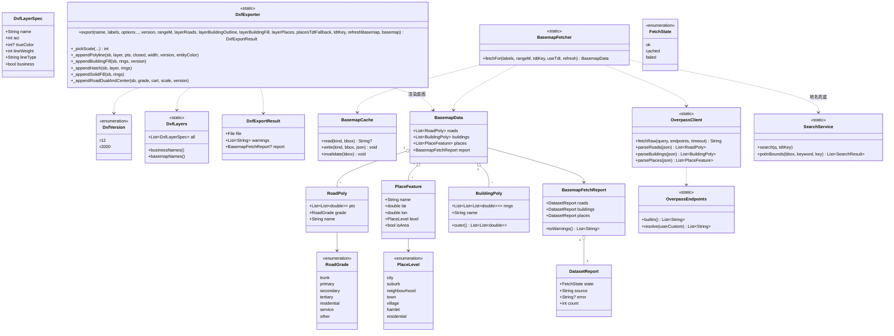

# 滑洲云图 ovimap — 增量技术设计 + 任务分解：DXF 底图矢量质量攻坚（v1.0）

> 类型：**增量设计**（只描述本次变更，不重写全量架构）
> 产出人：架构师 高见远　|　输入：`docs/sop/03-增量PRD-DXF底图.md`（许清楚）
> 交付对象：软件工程师（按 T1→T5 顺序实现）、团队主理人
> 技术底座：**Flutter 3.x + 自研 `lib/export/dxf.dart`**（依赖零新增）
> 主题：`底图可信 · 制图规范`——一次性同时修好**数据缺失**与**制图不规范**两条线，不再打补丁。

---

## 0. 设计总纲（给工程师的 5 句话）

1. **两条线必须同批落地**（PRD §2.2）：**数据线**（Overpass 稳定性 + 从未抓取地名 + 项目级缓存）与**制图线**（道路双线/中心线分级、建筑填充、图层线宽/真彩、比例尺驱动线宽）**互为前提**。分批做用户仍不满意。
2. **唯一"新技术前提"是 DXF 版本**：默认升级 **R2000(AC1015)**，才能用 **图层线宽 370 + 真彩 420 + HATCH**；**R12 路径完整保留**做老软件兜底（经典 POLYLINE + SOLID 近似填充 + 纯 ACI 色）。
3. **关键洞察（决定实现方式）**：底图所有"线宽/字号"**不再用真实米数**，而是**纸面毫米 × 出图比例**换算成图纸米数——一举解决 N5（比例尺放大"粗"感）、N6（建筑名偏小）、A2（缩小后建筑塌陷）。
4. **复用优先**：`buildLabelChains` 链口径、`_appendCorridor` 的法向偏移算法、`CacheTileProvider` 的磁盘缓存模式、`SearchService._tianditu` 全部复用；本次**只新增 3 个文件**（版本枚举、图层规范、底图数据层），其余为改造。
5. **不回归红线**：杆路/管廊/配线/桩号/距离/标签/图例/图签/指北针的**既有业务出图行为一字不改**；DXF 全部沿用 **GBK(ANSI_936) 写盘**；业务文字高度维持现状（只有**底图图层**改用比例尺驱动尺寸）。

---

## 1. 实现方案（逐 PRD P0 项）

### P0-5（先做，是其余项的技术前提）　DXF 版本升级 R2000（默认）+ 保留 R12

**现状**：`dxf.dart:55` 固定 `AC1009`；全仓无 `370/420/AC1015`；图层表 `dxf.dart:61-74` 仅 `62`(ACI)+`6`(线型)。

**落地方案**
- 新增 `lib/export/dxf_version.dart`：`enum DxfVersion { r12, r2000 }` + `acadVerOf(version)`（R12→`AC1009`，R2000→`AC1015`）。
- `DxfExporter.export` 新增形参 `DxfVersion version = DxfVersion.r2000`（默认切 R2000）。
- 新增 `lib/export/dxf_layers.dart`：**图层规范表**（见 §3），集中定义 `{name, aci, truecolor, lineweight}`；写出 `LAYER` 记录时按版本 gate：
  - **R2000**：`62`(ACI 兜底) + `6`(线型) + **`370`(线宽 1/100mm)** + **`420`(真彩 24bit)**；
  - **R12**：**只写 `62` + `6`**，**绝不写 370/420**（老读取器会拒）。
- 多段线写出按版本分支：**R2000 → `LWPOLYLINE`**（`90` 点数 / `70` 闭合位 / `43` 常宽）；**R12 → 经典 `POLYLINE/VERTEX/SEQEND`**（`40/41` 常宽）。两版本均保留 `$DWGCODEPAGE=ANSI_936` + GBK 字节写盘。
- **杆路"太粗"真因修正在 R2000 生效**：`GanLu` 图层线宽 `370=35`（0.35mm）→ 即便用 `LINE` 实体，CAD 也按图层线宽渲染，不再吃默认线宽。R12 兜底路径**保持现状 LINE**（不回归，见 §7 测试策略）。
- **为何最小变更**：几何**仍用经典 POLYLINE 也可**，但我们为满足"R2000 形态"采用 LWPOLYLINE（同一份点集，仅输出格式不同）；版本差异被收敛到**图层表 + 一个多段线写出分支 + 一个填充分支**，不触业务逻辑。

### P0-4　底图数据源可靠性（多镜像 + 项目级缓存 + 失败三态可见）

**现状**：`overpass.dart:100-104` 三镜像全境外；`:106-118` 7 天 TTL 磁盘缓存；失败仅 `dxf.dart:290-295` 攒 warning→`dialogs.dart:964-966` 一句 toast。

**落地方案**（新增 `lib/export/basemap.dart`，把"取数"从 `DxfExporter` 拆出为独立层）
- **端点可配**：`overpass.dart` 的 `_mirrors` 提升为 `OverpassEndpoints`（内置列表 + 用户自定义端点，存在 settings 可选，见 T4）。内置新增候选 `overpass.openstreetmap.ru`、`overpass.osm.jp`（**尽力而为**，国内可达性需实测，见 §8）。
- **网络层只负责竞速取数**：`OverpassClient.fetchRaw(query, {endpoints, timeout=15s})` 保留现有**并行竞速**（`overpass.dart:120-149`），首个成功即返回原文；不再在 OverpassClient 里做缓存/解析。
- **项目级底图缓存** `BasemapCache`（新增）：
  - 目录：`LabelStore.basemapDir()` → `${labelsDir}/basemap`（**跨项目/跨草稿持久**，非 7 天一次性）；子目录按数据集 `roads/ buildings/ places/`；附 `index.json` 记录 `{dataset, bbox, savedAt}`。
  - 命中策略：请求 bbox **被某条已缓存 bbox 包含**且 `age < 180d` → 直接复用（**离线可出图**）；命中后在渲染前按请求 bbox **裁剪要素**，避免大缓存带出远处要素。
  - **刷新底图**：`BasemapCache.invalidate(bbox)` 删除覆盖该区域的条目，供"刷新底图"动作使用。
  - 复用 `overpass.dart:157-164` 的 FNV-1a 稳定哈希做文件键。
- **失败三态可见** `BasemapFetchReport`（新增）：`roads/buildings/places` 各记 `{state: ok|cached|failed, source, error, count}`，聚合为 `ok / partial / failed`；`toWarnings()` 产出**中文可操作指引**（如"底图未获取：网络不可达，已使用上次缓存 / 本次无道路矢量"）。
- **可靠出图**：任一路径失败**不抛错**，`DxfExportResult` 增带 `report`，对话框弹**结构化说明**（替代单句 toast），文件照常分享。

### P0-3　地名 / 村庄 / 片区名抓取与注记

**现状**：`overpass.dart:13` 只查 `way["highway"]`、`:66-67` 只查 `building`，全仓无 `place=*` / `landuse`。

**落地方案**
- 新增 `OverpassClient.fetchPlaces` 查询：
  ```
  [out:json][timeout:25];
  ( node["place"](bbox);
    way["place"](bbox);
    relation["landuse"="residential"]["name"](bbox);
    way["landuse"="residential"]["name"](bbox); );
  out center tags;
  ```
  产出 `PlaceFeature{name, lat, lon, level, isArea, ring?}`；`way/relation` 用 `out center` 的 `center` 作落点（`landuse=residential` 且具名 → 视作"小区"）。
- **独立图层 `DiMing`**（新增，绿色 `ACI 3` / 真彩 `#2E7D32`），字号按级别分层（片区 > 小区/村，见 §3 表）。
- **修复 N1（关键）**：`overpass.dart:35-38` 的"无名次要路一律丢弃"改为**分级保留**（见 §3 keep 规则），且删除 `:56-57`（service 赋宽）与 `:35-38`（丢弃 service）的**自相矛盾死逻辑**——使**小区内部路网不再被砍光**，"小区"空间可辨（直接支撑 A5）。
- **天地图兜底（Q4）**：抽公共方法 `lib/services/tianditu.dart`（含 `kBuiltinTiandituKey`，从 `app_state.dart:251` 迁出常量、AppState 引用之），暴露 `poiInBounds(bbox, keyword, key)`；当 **OSM 地名数为 0 或少于阈值**且开关开启时，用关键词枚举（`小区/村/社区/花园/苑`）按 `mapBound=bbox` 检索 POI 作**兜底补名**，与 OSM 结果**按名称+邻近去重**。
- 天地图**不做几何源**（N7）：只补点/地名，不参与建筑/道路。

### P0-2　道路分级制图（双线描边 + 中心线，解决"路太粗/不粘连"）

**现状**：`dxf.dart:313-315` 直接拿 `rp.width`（真实 2~12m）当 `POLYLINE 40/41` 常宽 → 相邻路粘连。

**落地方案**
- **不再 1:1 用真实路宽**：新增 `RoadGrade`（trunk/primary/secondary/tertiary/residential/service/other）与 **"纸面毫米 → 图纸米"映射**（`meter = paperMm/1000 × scale`，`scale` 见 P0-4/N5）。
- **双线描边 + 中心线**：
  - `DaoLuBian`（新增，浅灰 `250` / `#C8C8C8`）：用 **`_appendCorridor` 同款法向偏移算法**（`dxf.dart:443-481`）生成道路两侧**两条平行偏移线**（半宽 = 纸面半宽/2），**不闭合**；
  - `DaoLuZhong`（新增）：道路**中心线**（按等级**实体色** `62`(R12)/`420`(R2000)），线型实线；
  - 至少 3 个可见等级（主干/次干/支路/小路），相邻路因"瘦身"不再粘连。
- **按等级网格简化（N4）**：`_roadSimplificationTolerance`（`dxf.dart:1037` 固定 1.0m）改为 `roadTolM(grade)` 分档（主干 0.5 → 小路 2.0）。
- **路名注记**：沿用 `dxf.dart:324-355` 的"沿弧长重复 + 随等级字号"逻辑，但**字号改为纸面毫米驱动**（`hMeter = roadLabelMm × scale/1000`），随等级递减。

### P0-1　建筑"成片可辨"（填充 + 图层规范 + 几何规范化）

**现状**：`dxf.dart:370` 闭合 POLYLINE 无填充，`JianZhu` 色 `8`（深灰）；关系型建筑 `overpass.dart:74-86` 当单环处理（N2）。

**落地方案**
- **几何规范化（N2）**：`parseBuildings` 中，`way` 取单环；`relation` 按 `role=outer/inner` **缝合成员 way 为闭合环**，**每个外环输出一个 `BuildingPoly`**（内环作孔，R2000 HATCH 时参与边界、R12 忽略孔）；缝合按端点量化匹配贪心拼接。
- **新增填充**：
  - **R2000 → `HATCH`**（pattern `SOLID`）写 `JianZhuFill`；
  - **R12 → `SOLID` 三角形近似填充**（对建筑外环做**耳切三角化**，逐三角形写 `SOLID` 四顶点实体）。
- **图层配色规范**：`JianZhu` 改**浅灰细线**（`#B0B0B0` / ACI 8），`JianZhuFill` 用**更浅灰**（`#EFEFEF` / ACI 252）→ 建筑成"成片浅灰块"，与道路、空白**三层分明**（A1/A2）。
- 建筑名注记（N6）：字号由纸面毫米驱动（`1.6mm`），仅对**有 name** 的建筑输出；字号显著大于现状（1:2000 下约 3.2m，不再是 1.5mm 不可见）。

### P0-5 附带　体量控制

- 底图**图层细分开关**（道路 / 建筑轮廓 / 建筑填充 / 地名，各自可勾，替代现在"一个总开关全有全无"）。
- **范围档位**（Q5）：`rangeM ∈ {300, 500, 880, 1000}`，默认 **880m**（对齐 `dxf.dart:270` 现状）。范围由"线路包围盒外扩 `rangeM` 米"计算（**度换算按纬度自适应**，修复现状经/纬不等距）。
- 建筑轮廓**不做简化**（保留全部点，正确），仅道路按等级简化 + 地名去重。

---

## 2. 文件清单（新增 / 修改，精确路径）

**新增（3 个源文件 + 1 个服务 + 测试）**
| 文件 | 作用 |
|---|---|
| `lib/export/dxf_version.dart` | `enum DxfVersion { r12, r2000 }` + `acadVerOf()` |
| `lib/export/dxf_layers.dart` | 图层规范表（name/aci/truecolor/lineweight/lineType/类别） |
| `lib/export/basemap.dart` | `BasemapData` / `BasemapFetcher` / `BasemapCache` / `BasemapFetchReport` / `RoadGrade` / `PlaceLevel` / `RoadPoly` / `BuildingPoly` / `PlaceFeature`（**从 overpass.dart 迁出并扩展**） |
| `lib/services/tianditu.dart` | 抽公共天地图调用 `poiInBounds()` + `kBuiltinTiandituKey`（原 `app_state.dart:251` 常量迁出） |
| `test/_dxf_fixture.dart` | 结构/e2e 共用标签夹具 + 合成 `BasemapData`（**去重、供多测试复用、无网络**） |
| `test/dxf_r2000_test.dart` | R2000 形态：`AC1015`/`370`/`420`/`LWPOLYLINE`/`HATCH`/新图层 |
| `test/basemap_cache_test.dart` | 项目级缓存命中/覆盖复用/刷新/离线 |
| `test/overpass_parse_test.dart` | N1 keep 规则、N2 关系多环缝合、地名解析（**纯解析，无网络**） |

**修改**
| 文件 | 改动要点 |
|---|---|
| `lib/export/dxf.dart` | 版本分支；图层表引用 `dxf_layers`；道路双线+中心线分级；建筑填充；地名图层；**比例尺驱动底图线宽/字号**；`rangeM` 参数化；`DxfExportResult` 增 `report`；新增 `basemap` 注入口 |
| `lib/export/overpass.dart` | 拆出 `fetchRaw()`（仅竞速）；`fetchRoads/fetchBuildings/fetchPlaces` 改为**纯解析** `parseRoads/parseBuildings/parsePlaces`；N1/N2 修复；`_mirrors`→`OverpassEndpoints` |
| `lib/ui/dialogs.dart` | `showDxfOptions`：版本开关 / 图层细分开关 / 范围档位 / 天地图兜底开关 / 刷新底图；**文案修正**（`dialogs.dart:923` 由"道路/建筑名称"改为"道路/建筑/地名"）；默认值调整；失败三态结构化展示 |
| `lib/state/app_state.dart` | `builtinTdtKey` 改为引用 `kBuiltinTiandituKey`（值不变，单一来源） |
| `lib/export/archive_book.dart` | `:46-50` 调用点**显式化** `version: DxfVersion.r2000`（保持 `includeSurroundings: false` 离线出图语义） |
| `lib/services/store.dart` | 新增 `basemapDir()`（对齐现有 `tilesDir()/exportDir()` 模式） |
| `test/dxf_structure_test.dart` | **参数化到版本维度**：R12 结构断言**原样保留**，显式请求 `version: DxfVersion.r12` |
| `test/dxf_e2e_test.dart` | 同上：显式请求 `version: DxfVersion.r12`（断言一字不改） |
| `lib/ui/settings_menu.dart`（可选 P1） | 「Overpass 镜像/自定义端点」设置项 |

> 说明：`lib/models/map_label.dart`、`csv.dart`、`kml.dart`、`photo_book.dart`、`topo*.dart` **不动**。

---

## 3. 数据结构与接口

### 3.1 类图（Mermaid）



### 3.2 关键 Dart 签名（新增/改动）

```dart
// ---------- lib/export/dxf_version.dart ----------
enum DxfVersion { r12, r2000 }
String acadVerOf(DxfVersion v) => switch (v) {
  DxfVersion.r12   => 'AC1009',
  DxfVersion.r2000 => 'AC1015',
};

// ---------- lib/export/dxf_layers.dart ----------
class DxfLayerSpec {
  final String name; final int aci; final int? trueColor;
  final int lineWeight;      // 1/100mm，仅 R2000 写出（370）
  final String lineType; final bool business;
  const DxfLayerSpec(...);
}
class DxfLayers {
  static const List<DxfLayerSpec> all = [ /* 见 3.3 表 */ ];
  static const Set<String> basemap = {'DaoLuBian','DaoLuZhong','DaoLu',
                                       'JianZhu','JianZhuFill','DiMing'};
}

// ---------- lib/export/basemap.dart ----------
enum RoadGrade { trunk, primary, secondary, tertiary, residential, service, other }
enum PlaceLevel { city, suburb, neighbourhood, town, village, hamlet, residential }
enum FetchState { ok, cached, failed }

class RoadPoly   { final List<List<double>> pts; final RoadGrade grade; final String name; }
class BuildingPoly {
  final List<List<List<double>>> rings;  // rings[0]=外环, 其余=孔
  final String name;
  List<List<double>> get outer => rings.first;
}
class PlaceFeature { final String name; final double lat, lon;
                     final PlaceLevel level; final bool isArea;
                     final List<List<double>>? ring; }

class DatasetReport { final FetchState state; final String source;
                      final String? error; final int count; }
class BasemapFetchReport {
  final DatasetReport roads, buildings, places;
  bool get anyFailed => roads.state==FetchState.failed
                     || buildings.state==FetchState.failed
                     || places.state==FetchState.failed;
  List<String> toWarnings();   // 中文可操作指引
}
class BasemapData {
  final List<RoadPoly> roads; final List<BuildingPoly> buildings;
  final List<PlaceFeature> places; final BasemapFetchReport report;
}

class BasemapCache {
  Future<String?> read(String kind, List<double> bbox);   // 含覆盖复用
  Future<void> write(String kind, List<double> bbox, String json);
  Future<void> invalidate(List<double> bbox);             // 刷新底图
}

class BasemapFetcher {
  static Future<BasemapData> fetchFor(
    List<MapLabel> labels, {
    double rangeM = 880, String tdtKey = '', bool useTdt = true,
    bool refresh = false, BasemapCache? cache,
  });
}

// ---------- lib/export/overpass.dart（重构） ----------
class OverpassClient {
  static Future<String> fetchRaw(String query,
      {List<String>? endpoints, Duration timeout = const Duration(seconds:15)});
  static List<RoadPoly>     parseRoads(String json);      // 含 N1 分级保留
  static List<BuildingPoly> parseBuildings(String json);  // 含 N2 多环缝合
  static List<PlaceFeature> parsePlaces(String json);
}
class OverpassEndpoints {
  static List<String> builtin();                       // 内置候选（含新增）
  static List<String> resolve(String userCustom);      // 用户自定义端点并入
}

// ---------- lib/services/tianditu.dart（抽取） ----------
const String kBuiltinTiandituKey = '361a1ac3927595e13b295fa9cbb77974';
class TiandituClient {
  static Future<List<SearchResult>> poiInBounds(
      List<double> bbox, String keyword, String key);
}

// ---------- lib/export/dxf.dart（签名扩展，向后兼容） ----------
static Future<DxfExportResult> export({
  required String name,
  required List<MapLabel> labels,
  bool includeLabelSymbols = true,
  double corridorWidth = 0,
  bool includeSurroundings = false,
  bool showStakes = true,
  bool showLegend = true,
  bool completionRed = false,
  bool straightenedWiring = false,
  // —— 本次新增（带默认值，旧调用点无需改）——
  DxfVersion version = DxfVersion.r2000,
  double rangeM = 880,
  bool layerRoads = true,
  bool layerBuildingOutline = true,
  bool layerBuildingFill = true,
  bool layerPlaces = true,
  bool placesTdtFallback = true,
  String tdtKey = '',
  bool refreshBasemap = false,
  BasemapData? basemap,   // 已取好的底图（测试注入 / 复用）
});

// ---------- lib/services/store.dart（新增） ----------
Future<Directory> basemapDir();   // ${labelsDir}/basemap
```

### 3.3 图层规范表（`DxfLayers.all`）

| 图层 | 类别 | 内容 | ACI(62) | 真彩(420) | 线宽(370, R2000) | 线型 |
|---|---|---|---|---|---|---|
| `GanLu` | 业务 | 杆路 / 竣工红 | 3（竣工 1） | `#FFC000` | 35 (0.35mm) | CONTINUOUS |
| `GuanLang` | 业务 | 管廊 | 5 | `#00B0F0` | 50 | CONTINUOUS |
| `PeiXianTu` | 业务 | 配线图主线/箱体 | 7 | `#000000` | 30 | CONTINUOUS |
| `ZhuangHao` | 业务 | 桩号 | 6 | `#FF00FF` | 18 | CONTINUOUS |
| `BiaoQian` | 业务 | 标签符号/文字 | 2 | `#FFFF00` | 18 | CONTINUOUS |
| `JuLi` | 业务 | 段距/盘留/型号 | 7 | `#000000` | 18 | CONTINUOUS |
| `BeiFangZhen` | 图框 | 指北针 | 7 | `#000000` | 35 | CONTINUOUS |
| `TuQian` | 图框 | 图框/图例/图签 | 7 | `#000000` | 35 | CONTINUOUS |
| **`DaoLuBian`** | 底图 | 道路双线描边 | 250 | `#C8C8C8` | 20 | CONTINUOUS |
| **`DaoLuZhong`** | 底图 | 道路中心线 | 8（实体色按等级） | `#7F8C8D` | 15 | CONTINUOUS |
| `DaoLu` | 底图 | 道路名注记(TEXT) | 7 | `#595959` | 18 | CONTINUOUS |
| `JianZhu` | 底图 | 建筑轮廓 | 8 | `#B0B0B0` | 13 | CONTINUOUS |
| **`JianZhuFill`** | 底图 | 建筑填充 | 252 | `#EFEFEF` | -3(默认) | CONTINUOUS |
| **`DiMing`** | 底图 | 地名/小区名 | 3 | `#2E7D32` | 18 | CONTINUOUS |

> R2000 写 `370/420`；**R12 只写 `62/6`**（真彩以最接近 ACI 兜底）。`DaoLuZhong` 的**等级色**在**实体**上用 `62`(R12)/`420`(R2000) 覆盖，不靠图层色。

### 3.4 道路等级 → 线宽/颜色/字号/简化容差 映射表（底图，纸面毫米）

> `图纸米 = 纸面毫米 ÷ 1000 × scale`（`scale` 为出图比例分母，见 3.5）。**半宽** = 双线偏移量。

| 等级 | 命中 `highway` | 半宽(mm) | 中心线宽(mm) | 中心线色 ACI / hex | 路名字号(mm) | 简化容差(m) |
|---|---|---|---|---|---|---|
| trunk | motorway/trunk/*_link | 0.45 | 0.18 | 1 / `#C0392B` | 2.0 | 0.5 |
| primary | primary | 0.38 | 0.16 | 30 / `#E67E22` | 1.9 | 0.6 |
| secondary | secondary | 0.30 | 0.14 | 2 / `#F1C40F` | 1.7 | 0.8 |
| tertiary | tertiary | 0.25 | 0.12 | 2 / `#F1C40F` | 1.5 | 1.0 |
| residential | residential/unclassified/living_street | 0.18 | 0.10 | 8 / `#95A5A6` | 1.3 | 1.5 |
| service | service/track/path | 0.12 | 0.08 | 253 / `#BDC3C7` | 1.0 | 2.0 |
| other | 其余 | 0.10 | 0.07 | 8 / `#95A5A6` | 1.0 | 2.0 |

**N1 keep 规则（替换 `overpass.dart:35-38`）**：仅丢弃**无名**的 `footway/steps/cycleway/pedestrian/bridleway`；**无名 `service/track/path/residential/living_street/unclassified` 一律保留**（小区内部路网）。

**地名注记字号表（纸面毫米，转图纸米）**：

| 级别 | 来源 | 字号(mm) |
|---|---|---|
| city / suburb（片区） | `place=city/suburb/quarter` | 2.8 / 2.5 |
| neighbourhood / residential（小区） | `place=neighbourhood` / `landuse=residential` | 2.2 |
| town / village（村镇） | `place=town/village` | 2.2 |
| hamlet | `place=hamlet` | 1.8 |
| 建筑名 | building `name` | 1.6 |

### 3.5 比例尺与坐标（N5 修正）

- `scale = _pickScale(线路包围盒)`：**只按线路（labels）范围估算**（不再被过大的底图外扩拖大），用于**所有底图线宽/字号的纸面→图纸换算**；图签仍报此比例。
- 坐标投影**沿用现状** `baseLon/baseLat/scaleX/scaleY`（`dxf.dart:88-91`）——**底图与业务共用同一套投影，不存在坐标/单位 Bug（N3 排除项，勿排查）**。
- 底图几何来源坐标：**Overpass=WGS84**；**天地图=CGCS2000（≈WGS84，差异 <1m，可视作同系）**——**不做 GCJ/BD 转换**（与业务点一致）。

### 3.6 缓存结构

```
<app>/labels/basemap/
  index.json                     # [{dataset, minLat,minLon,maxLat,maxLon, savedAt}]
  roads/<fnv1a>.json             # Overpass 原文（out geom）
  buildings/<fnv1a>.json
  places/<fnv1a>.json
  places_tdt/<fnv1a>.json        # 天地图兜底结果
```
- 键：`_fnv1a(dataset + 量化bbox)`（复用 `overpass.dart:157-164`）。
- 命中：`index` 中存在 `dataset` 相同且 **bbox 覆盖请求 bbox** 且 `age<180d`。
- 刷新：`invalidate(bbox)` 删除覆盖该 bbox 的条目。
- 渲染前裁剪：要素若整体落在请求 bbox 外则跳过（防大缓存带出远处要素）。

---

## 4. 程序调用流程

### A. 导出主流程（含缓存/抓取/地名/版本分支）

```mermaid
sequenceDiagram
  actor U as 用户
  participant D as showDxfOptions(dialogs)
  participant DX as DxfExporter
  participant BF as BasemapFetcher
  participant BC as BasemapCache
  participant OP as OverpassClient
  participant TD as TiandituClient(兜底)

  U->>D: 勾选 版本R2000 / 图层 / 范围880m / 天地图兜底
  D->>DX: export(labels, version, rangeM, layerFlags, tdtKey, refresh, basemap:null)
  alt includeSurroundings 且 basemap==null
    DX->>BF: fetchFor(labels, rangeM, tdtKey, useTdt, refresh)
    par 道路/建筑/地名 并行
      BF->>BC: read("roads", bbox)
      alt 命中且未过期
        BC-->>BF: cached JSON (state=cached, 离线可用)
      else 未命中/刷新
        BF->>OP: fetchRaw(query, endpoints)  // 多镜像并行竞速, 15s
        OP-->>BF: JSON / error
        BF->>BC: write("roads", bbox, json)
      end
    and building / places 同上
    end
    opt 地名为空且 useTdt
      BF->>TD: poiInBounds(bbox, 关键词, key)
      TD-->>BF: POI 点 (兜底补名)
    end
    BF-->>DX: BasemapData{roads,buildings,places,report}
  end
  DX->>DX: _pickScale(线路bbox) ; 图层表(370/420 gate by version)
  DX->>DX: 业务层(杆路/管廊/桩号/标签/配线图) —— 不变
  DX->>DX: 底图: 道路双线+中心线(纸面mm×scale) / 建筑轮廓+填充(HATCH|SOLID) / 地名
  DX->>DX: 文字后置 → 图框/图例/指北针/图签
  DX->>DX: GBK 字节写盘 (robustWriteBytes)
  DX-->>D: DxfExportResult(file, warnings, report)
  D-->>U: 失败三态结构化提示 + shareFile
```

### B. 版本分支（R12 vs R2000）

```mermaid
sequenceDiagram
  participant DX as DxfExporter
  participant L as DxfLayers
  Note over DX: HEADER: $ACADVER = acadVerOf(version); $DWGCODEPAGE=ANSI_936
  DX->>L: 写 LAYER 记录
  alt version == r2000
    L-->>DX: LAYER = 62 + 6 + 370(线宽) + 420(真彩)
    DX->>DX: 多段线 → LWPOLYLINE (90/70/43)
    DX->>DX: 建筑填充 → HATCH(SOLID) 于 JianZhuFill
  else version == r12
    L-->>DX: LAYER = 62 + 6  (无 370/420)
    DX->>DX: 多段线 → 经典 POLYLINE/VERTEX/SEQEND (40/41)
    DX->>DX: 建筑填充 → SOLID 三角近似 于 JianZhuFill
  end
  DX->>DX: GBK 写盘（两版本一致）
```

---

## 5. 任务列表（T1..T5，按依赖顺序）

> 依赖图：`T1`、`T2` **可并行**（无相互依赖）；`T3` 依赖 `T1+T2`；`T4` 依赖 `T1`（+`T2` 的类型）；`T5` 依赖 `T1..T4`。

### T1　版本基建：DXF 版本枚举 + 图层规范 + 双版本写出 + 测试参数化【P0】
- **目标**：`DxfExporter` 支持 `DxfVersion`，默认 R2000；R12 路径**行为不变**；图层表集中化并支持 `370/420`。
- **文件**：新增 `lib/export/dxf_version.dart`、`lib/export/dxf_layers.dart`；改 `lib/export/dxf.dart`（HEADER/图层表/`_appendPolyline` 版本分支）；新增 `test/_dxf_fixture.dart`、`test/dxf_r2000_test.dart`；改 `test/dxf_structure_test.dart`、`test/dxf_e2e_test.dart`（**显式 `version: DxfVersion.r12`，断言不改**）。
- **验收点**：R12 请求下 既有结构/e2e 断言**全绿且断言内容未变**；R2000 请求下输出含 `AC1015` / `370` / `420` / `LWPOLYLINE`；R12 输出**不含** `LWPOLYLINE` 且**不含** `370/420`；两版本 GBK 中文（`李`=0xC0 0xEE）完整。
- **前置**：无。

### T2　底图数据层：Overpass 重构（分级/N1/N2/地名）+ 项目级缓存 + 失败三态 + 天地图兜底【P0】
- **目标**：把"取数+缓存+解析"从渲染拆出，国内可靠性提升、地名可抓、失败可见、离线可复用。
- **文件**：新增 `lib/export/basemap.dart`、`lib/services/tianditu.dart`；改 `lib/export/overpass.dart`、`lib/services/store.dart`（`basemapDir()`）、`lib/state/app_state.dart`（引用 `kBuiltinTiandituKey`）；新增 `test/overpass_parse_test.dart`、`test/basemap_cache_test.dart`。
- **验收点**：`parseRoads` 保留无名 service/track（**N1 修复**）；`parseBuildings` 对 relation 多环输出多个 `BuildingPoly`（**N2**）；`parsePlaces` 正确取 `place=*` 与 `landuse=residential`；`BasemapCache` 覆盖复用命中且离线可读、`invalidate` 生效；`BasemapFetchReport` 三态与中文指引正确；**零网络**单测全绿。
- **前置**：无（与 T1 并行）。

### T3　制图渲染层：道路双线+中心线 / 建筑填充 / 地名图层 / 比例尺驱动线宽 / 按等级简化【P0】
- **目标**：DXF 图面"像设计院出图"——道路分级不粘连、建筑成片可辨、地名可读、线宽可控。
- **文件**：改 `lib/export/dxf.dart`（渲染主体：`_appendRoadDualAndCenter`、`_appendBuildingFill`/`_appendHatch`/`_appendSolidFill`+耳切三角化、`DiMing` 输出、`_pickScale` 提前、字号/线宽纸面换算、`roadTolM`）；扩 `test/dxf_r2000_test.dart`（渲染断言）。
- **验收点**：用**合成 `BasemapData`**（注入 `basemap:`，无网络）导出：`DaoLuBian` 出现成对偏移线、`DaoLuZhong` 中心线按等级着色；相邻路不粘连（半宽按纸面 mm×scale）；R2000 出现 `HATCH`/`JianZhuFill`，R12 出现 `SOLID` 填充且无 `HATCH`；`DiMing` 出现地名文字；1:2000 下主干描边总宽 ≈0.9mm（换算正确）。
- **前置**：T1、T2。

### T4　交互层：导出对话框选项 + 文案修正 + 失败可见 + 设置项【P0】
- **目标**：用户可选择版本/图层/范围/兜底/刷新，失败看得到原因。
- **文件**：改 `lib/ui/dialogs.dart`（`showDxfOptions`：版本开关、4 个图层细分开关、范围档位 `300/500/880/1000`、天地图兜底开关、刷新底图；**文案修正** `:923`；默认值；`r.report.toWarnings()` 结构化展示）；改 `lib/export/archive_book.dart`（显式 `version: DxfVersion.r2000`）；可选改 `lib/ui/settings_menu.dart`（Overpass 端点）。
- **验收点**：对话框可切 R2000/R12；可分别勾选 道路/建筑轮廓/建筑填充/地名；范围可选且默认 880m；勾选持久化；失败弹**结构化中文说明**（区分缺道路/缺建筑/全失败）；文案不再误导为仅"名称"。
- **前置**：T1、T2（T3 的渲染开关在 T3 兑现）。

### T5　集成与回归：archive 口径 + 端到端 + 验收样例 + 红线核对【P0】
- **目标**：整体可用、业务出图零回归、PRD §1 验收清单可逐条判定。
- **文件**：改 `test/archive_book_test.dart`（确认默认 R2000 下成册仍含 `路由图.dxf`）；新增 `test/dxf_acceptance_test.dart`（A1–A10 中可自动化的项：图层存在、填充存在、道路等级数≥3、GBK 无乱码、失败三态字符串）；核对 §7 红线。
- **验收点**：`flutter test` 全绿；R12 与 R2000 双路径均被覆盖；杆路/桩号/距离/标签/图例/图签/指北针输出**与改造前逐字节语义一致**（除默认版本导致的形态差异）。
- **前置**：T1–T4。

---

## 6. 依赖包

**预期零新增**（`pubspec.yaml` 不动）：
```
- http@^1.2.0        : Overpass / 天地图 网络请求（已在）
- gbk_codec@^0.4.0   : GBK(ANSI_936) 写盘（已在，DXF 必须）
- archive@^3.6.1     : 成册 ZIP（已在）
- share_plus@^10.0.0 : 分享文件（已在）
- path_provider/flutter_map/provider/latlong2 : 目录与地图（已在）
```
> 三角化（耳切）、HATCH/SOLID 写出、FNV-1a 哈希**全部自研纯 Dart**，不引入依赖。

---

## 7. 共享知识 / 红线（工程师必读）

**不可破坏的红线**
1. **链口径**：杆路一律走 `buildLabelChains`（`map_label.dart:202`）——箱体/文字插在两杆之间**不打断杆路**；本次**不得**改用"相邻两点同组"判定。
2. **GBK 写盘**：两版本 DXF 均 `robustWriteBytes(f, gbk_bytes.encode(sb))`，`$DWGCODEPAGE=ANSI_936`；引用字符串原样内联（组码值不得出现未转义换行）。
3. **坐标**：存储 WGS84；底图几何（Overpass=WGS84 / 天地图 CGCS2000≈WGS84）**不做 GCJ/BD 转换**，与业务点同投影。
4. **桩号跨链连续**：`globalCum/chainCum`（`dxf.dart:108,121-165`）语义不变。
5. **配线图走向一致**：`PeiXianTu` 主干/地理式配线/拉直配线逻辑不变。
6. **撤销 20 步**：与本次无关，勿动。
7. **既有业务出图不得回归**：杆路 `GanLu`、管廊 `GuanLang`、桩号 `ZhuangHao`、距离 `JuLi`、标签 `BiaoQian`、图例/图签/指北针/配线图 `PeiXianTu` **输出语义保持不变**；业务文字高度**维持现状米数**（仅底图图层改用比例尺驱动尺寸）。

**测试策略（解决集成风险，硬性）**
- **R12 路径保持可用且继续被测试**：`dxf_structure_test.dart` / `dxf_e2e_test.dart` **显式请求 `version: DxfVersion.r12`**，其 R12 断言（无 LWPOLYLINE、POLYLINE/SEQEND 配对、GBK 完整、`40\n0.600`）**一字不改**。
- **R2000 路径新增测试**：`test/dxf_r2000_test.dart` 断言 `AC1015` / `370` / `420` / `LWPOLYLINE` / `HATCH`；用**注入的合成 `BasemapData`**（无网络）。
- **参数化维度**：版本=测试入参；**既有断言"不变"**，只是**运行在显式 R12 参数下**——**不允许**"改默认值→老测试挂→临时放宽断言"。
- **调用点**：`archive_book.dart:49` 默认值变化后**语义不变**（仍 `includeSurroundings:false` 离线出图），**显式** `version: DxfVersion.r2000` 以固定行为；`archive_book_test.dart` 只校验成册含 `路由图.dxf`，**不受影响**。

---

## 8. 待明确事项（需实测/拍板）

1. **国内可达 Overpass 端点**：内置候选（`overpass.openstreetmap.ru`、`overpass.osm.jp`）**可达性需实测**；建议同时提供**用户自定义端点**开关（T4）。若无稳定国内端点，则**依赖项目级缓存 + 失败可见**兜底（首次可能仍需境外镜像）。
2. **天地图 `v2/search` 是否支持纯 bbox（无关键词）检索**：若不支持，采用**关键词枚举**（`小区/村/社区/花园/苑`）按 `mapBound=bbox` 检索；关键字清单与调用量上限待定。
3. **HATCH(SOLID) 与 SOLID 三角填充在浩辰/中望/天正 的兼容性**：需各测一次（R2000 应无碍；R12 SOLID 三角填充的接缝观感需目视确认）。
4. **范围档位与体积阈值**：1000m 档在密集城区的 DXF 体积上限，需实测后决定是否触发"小面积无名建筑合并"。
5. **地名去重规则**：OSM `place` 与 `landuse=residential` 同名邻近的合并半径（建议 50m），以及天地图兜底与 OSM 的**同名优先级**（默认 OSM 优先）。
6. **出图比例口径**：`_pickScale` 改为**仅按线路范围**估算后，图签所示比例与"底图外扩是否超框"的观感需在验收样例上确认（必要时提供"比例锁定"选项）。

---

*（本文件为增量设计，可直接交软件工程师执行；§1 实现方案 + §5 任务列表为执行主纲，§7 红线为不可违背约束。）*
